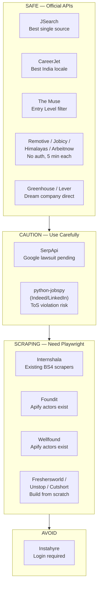
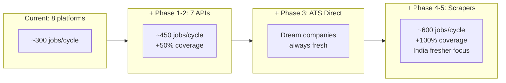

# Aggregator Research — Full Deep Dive

Comprehensive analysis of 22 job platforms: **API availability, scraping legality, existing GitHub scrapers, and integration strategy** for an India-based fresher developer.

---

## Legal Context: Is It OK to Scrape?

### The Short Answer

| Method | Risk Level | Notes |
|--------|-----------|-------|
| Official public API (no auth) | **Safe** | Explicitly provided for developers |
| Official API with free key | **Safe** | Within ToS, rate-limited |
| Scraping public pages (respecting robots.txt) | **Low risk** | Legal precedent supports it (hiQ v LinkedIn) but ToS may prohibit |
| Scraping behind login | **High risk** | Likely violates ToS, potential CFAA issues |
| Bypassing anti-scraping measures | **Very high risk** | Google sued SerpApi for exactly this (Dec 2025) |

### Key Legal Precedents

| Case | Year | Outcome | Relevance |
|------|------|---------|-----------|
| [hiQ Labs v. LinkedIn](https://en.wikipedia.org/wiki/HiQ_Labs_v._LinkedIn) | 2017-2022 | Scraping *public* data doesn't violate CFAA. But hiQ paid $500K for breach of ToS + fake accounts. | Public data = OK legally, but ToS breach = contract liability |
| [Google v. SerpApi](https://blog.google/technology/safety-security/serpapi-lawsuit/) | Dec 2025 | Google sued SerpApi for "parasitic" scraping at massive scale (hundreds of millions/day), bypassing SearchGuard. **Ongoing.** | Don't bypass anti-bot measures. Don't scrape at commercial scale. |

### Our Risk Profile

We scrape **~300 jobs/hour** from public pages, respecting rate limits, for **personal job search** (not commercial resale). This is very low risk compared to SerpApi's hundreds of millions of daily requests. Still, prefer official APIs wherever available.

---

## Currently Integrated (8 Platforms)

### Scraping Risk Assessment

| Platform | Method | Legal Risk | Notes |
|----------|--------|-----------|-------|
| **Indeed** | python-jobspy (HTTP scraping) | **Medium** | Indeed's ToS explicitly prohibits scraping. But python-jobspy is widely used (5K+ GitHub stars). Personal use at low volume is unlikely to trigger enforcement. |
| **Naukri** | python-jobspy (HTTP scraping) | **Low-Medium** | No specific ToS found prohibiting scraping of public listings. Indian fair-use precedent supports scraping public job data. |
| **LinkedIn** | python-jobspy (read-only) | **Medium-High** | LinkedIn aggressively fights scrapers. We only READ (no login, no profile scraping). hiQ precedent protects public data scraping, but LinkedIn still pursues cases. |
| **Glassdoor** | python-jobspy (HTTP scraping) | **Low-Medium** | Less aggressive than Indeed/LinkedIn about scraping enforcement. |
| **RemoteOK** | [Official public API](https://remotive.com/api/remote-jobs) | **Safe** | Public JSON endpoint, no auth needed. |
| **Jooble** | [Official API](https://jooble.org/api/about) | **Safe** | Free API key, 500 req/day. Official developer program. |
| **Adzuna** | [Official API](https://developer.adzuna.com/) | **Safe** | Free developer API with app ID/key. |
| **HiringCafe** | Public GET endpoint | **Low** | No documented ToS. API appears intentionally public. Single-developer project. |

**Recommendation:** Replace Indeed/LinkedIn scraping with official API alternatives (JSearch, SerpApi) when possible. These give the same data through legal channels.

---

## Tier 1: High Priority — Official APIs + India Coverage

### 1. JSearch (RapidAPI)

| Aspect | Detail |
|--------|--------|
| **API** | `GET https://jsearch.p.rapidapi.com/search` |
| **Auth** | RapidAPI key (free signup) |
| **Free tier** | ~200 requests/month (RapidAPI basic) |
| **Scraping legality** | **Safe** — official API, no scraping needed |
| **India coverage** | High — powered by Google for Jobs, indexes Naukri/Indeed/LinkedIn |
| **Data source** | [RapidAPI JSearch](https://rapidapi.com/letscrape-6bRBa3QguO5/api/jsearch) |

**Why #1:** Single API covers what currently takes 4 scrapers (Indeed + Naukri + LinkedIn + Glassdoor). Google for Jobs already indexes these platforms. Eliminates scraping risk for the top sources.

**GitHub scrapers:** [AnumQ/find-jobs](https://github.com/AnumQ/find-jobs) — simple React app using JSearch API.

```
GET https://jsearch.p.rapidapi.com/search
Headers: X-RapidAPI-Key: <key>, X-RapidAPI-Host: jsearch.p.rapidapi.com
Params: query, page, num_pages, date_posted, remote_jobs_only
Response: { data: [{ job_title, employer_name, job_city, job_apply_link, job_description, job_posted_at }] }
```

### 2. SerpApi (Google Jobs)

| Aspect | Detail |
|--------|--------|
| **API** | `GET https://serpapi.com/search?engine=google_jobs` |
| **Auth** | API key (free signup) |
| **Free tier** | 100 searches/month (cached searches are free) |
| **Scraping legality** | **CAUTION** — [Google sued SerpApi in Dec 2025](https://blog.google/technology/safety-security/serpapi-lawsuit/) for "parasitic" scraping |
| **India coverage** | High — Google for Jobs index |
| **Pricing** | Free: 100/mo, $29.99/mo: 5,000 searches |

**Risk note:** Google filed a DMCA lawsuit against SerpApi in December 2025 for bypassing SearchGuard anti-bot measures at massive scale. Using SerpApi's free tier for personal job search is very different from SerpApi's commercial operation, but the legal cloud makes this less attractive than JSearch.

```
GET https://serpapi.com/search
Params: engine=google_jobs, q=python+developer, location=Bangalore, api_key=<key>
Response: { jobs_results: [{ title, company_name, location, description, detected_extensions }] }
```

### 3. CareerJet

| Aspect | Detail |
|--------|--------|
| **API** | [Official Python library](https://github.com/careerjet/careerjet-api-client-python) |
| **Auth** | Affiliate ID (free partner signup) |
| **Free tier** | Unlimited (affiliate model — they get traffic) |
| **Scraping legality** | **Safe** — official API with affiliate program |
| **India coverage** | High — dedicated `en_IN` locale |
| **PyPI** | `pip install careerjet-api` |

**Official library on GitHub:** [careerjet/careerjet-api-client-python](https://github.com/careerjet/careerjet-api-client-python)

```python
from careerjet_api import CareerjetAPIClient
cj = CareerjetAPIClient("en_IN")
result = cj.search({
    "affid": "<your_affiliate_id>",
    "keywords": "python developer",
    "location": "bangalore",
    "pagesize": 50,
})
# Returns: title, company, url, date, description, salary
```

### 4. The Muse

| Aspect | Detail |
|--------|--------|
| **API** | `GET https://www.themuse.com/api/public/jobs` |
| **Auth** | Optional (increases rate limit) |
| **Free tier** | 500 req/hr without key, 3600 req/hr with key |
| **Scraping legality** | **Safe** — [official public API](https://www.themuse.com/developers/api/v2) |
| **India coverage** | Medium — MNCs with India offices |
| **Fresher filter** | `level=Entry Level` parameter |
| **Docs** | [The Muse Developer API](https://www.themuse.com/developers/api/v2) |

**Best for freshers** — has an explicit `level=Entry Level` filter that no other platform offers via API.

```
GET https://www.themuse.com/api/public/jobs?category=Engineering&level=Entry%20Level&location=India&page=1
Response: JSON { results: [{ name, company.name, locations[].name, contents, publication_date }] }
```

### 5. Findwork

| Aspect | Detail |
|--------|--------|
| **API** | `GET https://findwork.dev/api/jobs/` |
| **Auth** | Token-based (free signup) |
| **Free tier** | Available (limits not documented) |
| **Scraping legality** | **Safe** — [official API](https://findwork.dev/) |
| **India coverage** | Medium — aggregates from HN, RemoteOK, WeWorkRemotely, Dribbble |
| **Docs** | [Findwork API](https://publicapi.dev/findwork-api) |

```
GET https://findwork.dev/api/jobs/?search=python&location=india
Headers: Authorization: Token <api_key>
Response: JSON { results: [{ role, company_name, location, remote, url, keywords, date_posted }] }
```

---

## Tier 2: Easy Wins — No Auth, Zero Setup

All four have free public APIs with no authentication required.

### 6. Remotive

| Aspect | Detail |
|--------|--------|
| **API** | `GET https://remotive.com/api/remote-jobs` |
| **Auth** | None |
| **Rate limit** | Max 2 requests/minute |
| **Scraping legality** | **Safe** — [official public API](https://github.com/remotive-com/remote-jobs-api) |
| **Coverage** | Remote jobs worldwide |
| **GitHub** | [remotive-com/remote-jobs-api](https://github.com/remotive-com/remote-jobs-api) (official) |
| **Apify** | [Remotive Scraper](https://apify.com/muscular_quadruplet/remotive-scraper) available |

```
GET https://remotive.com/api/remote-jobs?category=software-dev&limit=50
Response: { jobs: [{ title, company_name, candidate_required_location, url, publication_date, tags[], salary }] }
```

### 7. Jobicy

| Aspect | Detail |
|--------|--------|
| **API** | `GET https://jobicy.com/api/v2/remote-jobs` |
| **Auth** | None |
| **Rate limit** | Not documented |
| **Scraping legality** | **Safe** — public API |
| **Coverage** | Remote tech, has `geo=india` filter |

```
GET https://jobicy.com/api/v2/remote-jobs?count=50&geo=india&industry=tech&tag=python
Response: { jobs: [{ jobTitle, companyName, jobGeo, url, pubDate, jobIndustry, annualSalaryMin/Max }] }
```

### 8. Himalayas

| Aspect | Detail |
|--------|--------|
| **API** | `GET https://himalayas.app/jobs/api` |
| **Auth** | None |
| **Rate limit** | Max 20 jobs per request (reduced March 2025) |
| **Scraping legality** | **Safe** — [official public API](https://himalayas.app/api) |
| **Coverage** | Remote jobs, YC startups |
| **Apify** | [Himalayas Job Scraper](https://apify.com/shahidirfan/himalayas-job-scraper) available |

```
GET https://himalayas.app/jobs/api?limit=20&offset=0
Response: JSON array [{ title, companyName, locations, url, publishedDate, categories, seniority }]
Note: Use offset for pagination (max 20 per request since March 2025)
```

### 9. Arbeitnow

| Aspect | Detail |
|--------|--------|
| **API** | `GET https://www.arbeitnow.com/api/job-board-api` |
| **Auth** | None |
| **Rate limit** | Not documented |
| **Scraping legality** | **Safe** — [official public API](https://www.arbeitnow.com/blog/job-board-api) |
| **Coverage** | Europe-heavy, some remote |
| **Apify** | [Arbeitnow Scraper](https://apify.com/muscular_quadruplet/arbeitnow-scraper) available |
| **Special** | Has `visa_sponsorship` filter |

```
GET https://www.arbeitnow.com/api/job-board-api
Response: { data: [{ title, company_name, location, remote, url, tags[], created_at }] }
```

---

## Tier 3: India-Specific — No API, Scraping Needed

These are the most valuable for Indian freshers but have no official API. All require browser automation or HTML scraping.

### 10. Internshala

| Aspect | Detail |
|--------|--------|
| **Official API** | None |
| **Scraping legality** | **Medium** — No specific ToS prohibition found, but no API means they didn't intend programmatic access |
| **India coverage** | Very high — #1 platform for Indian freshers |
| **GitHub scrapers** | Multiple repos available |
| **Apify** | Not found |

**GitHub scrapers found:**

| Repo | Method | Notes |
|------|--------|-------|
| [het-parekh/Internshala-Web-Scraper](https://github.com/het-parekh/Internshala-Web-Scraper-Internshala.com) | BeautifulSoup4 | Filters, UI |
| [bhagatanirudh/Web-Scraper-Internshala](https://github.com/bhagatanirudh/Web-Scraper-Internshala) | Selenium | WhatsApp integration |
| [Shuubhim/Internshala_Internships_Data](https://github.com/Shuubhim/Internshala_Internships_Data) | Python script | Structured dataset output |
| [devanshds/Internshala-scraper](https://github.com/devanshds/Internshala-scraper) | Keyword search | Tabular export |
| [ligmitz/internshala-scraper](https://github.com/ligmitz/internshala-scraper) | Python | Has releases |
| [Vrashabh-Sontakke/Internship_Scraper](https://github.com/Vrashabh-Sontakke/Internship_Scraper) | Scrapy | DevOps focused |

**Recommendation:** Use BeautifulSoup approach (het-parekh's scraper) as a base. Internshala loads job data server-side, so Playwright isn't strictly needed.

### 11. Freshersworld

| Aspect | Detail |
|--------|--------|
| **Official API** | None |
| **Scraping legality** | **Low-Medium** — Public job listings |
| **India coverage** | Very high — exclusively fresher jobs |
| **GitHub scrapers** | None found |

**No existing scrapers on GitHub.** Would need to build from scratch. BeautifulSoup should work as the site is server-rendered.

### 12. Unstop (Dare2Compete)

| Aspect | Detail |
|--------|--------|
| **Official API** | None |
| **Scraping legality** | **Medium** — Modern SPA, likely harder to scrape |
| **India coverage** | Very high — campus hiring, hackathons |
| **GitHub scrapers** | None found |

**No existing scrapers on GitHub.** SPA-based site likely requires Playwright.

### 13. Foundit (Monster India)

| Aspect | Detail |
|--------|--------|
| **Official API** | None |
| **Scraping legality** | **Medium** |
| **India coverage** | High |
| **GitHub scrapers** | None found for Python |
| **Apify actors** | **Multiple available** |

**Apify actors found:**

| Actor | Author | Notes |
|-------|--------|-------|
| [Foundit Jobs Scraper](https://apify.com/easyapi/foundit-jobs-scraper) | easyapi | Detailed listings, companies, recruiters |
| [Foundit Jobs Scraper](https://apify.com/shahidirfan/foundit-jobs-scraper) | shahidirfan | Lightweight, fast |
| [Monster.com Scraper](https://apify.com/jupri/monster-scraper) | jupri | Legacy Monster endpoint |

**Recommendation:** Use Apify actors instead of building custom scraper. Apify has a free tier (100 actor runs/month).

### 14. Cutshort

| Aspect | Detail |
|--------|--------|
| **Official API** | None |
| **Scraping legality** | **Medium** |
| **India coverage** | High — Indian tech startups |
| **GitHub scrapers** | None found |

**No existing scrapers.** Would need custom Playwright scraper.

### 15. Instahyre

| Aspect | Detail |
|--------|--------|
| **Official API** | None |
| **Scraping legality** | **Medium-High** — Recruiter-driven, likely behind login |
| **India coverage** | High |
| **GitHub scrapers** | None found |

**No existing scrapers.** Requires login to view most jobs — highest risk to scrape.

### 16. Wellfound (AngelList)

| Aspect | Detail |
|--------|--------|
| **Official API** | None (old AngelList API discontinued) |
| **Scraping legality** | **High** — "Wellfound is notorious for blocking all web scrapers" (ScrapFly) |
| **India coverage** | High — startup ecosystem |
| **GitHub scrapers** | [jwc20/wellfound-scraper](https://github.com/jwc20/wellfound-scraper) — uses login + POST requests |
| **Apify actors** | [Wellfound Jobs Scraper](https://apify.com/mscraper/wellfound-jobs-scraper), [Wellfound Startups Scraper](https://apify.com/mscraper/wellfound-startups-scraper) |
| **Commercial** | [BrightData Wellfound Scraper](https://brightdata.com/products/web-scraper/angellist) (paid) |

**Recommendation:** Use Apify actor if integrating. Custom scraping is risky — Wellfound actively blocks scrapers.

---

## Tier 4: ATS Direct — Company Career Page APIs

Free, no-auth, officially documented APIs from ATS providers. **Zero legal risk.**

### 17. Greenhouse Job Board API

| Aspect | Detail |
|--------|--------|
| **API** | `GET https://boards-api.greenhouse.io/v1/boards/{token}/jobs` |
| **Auth** | None required for public boards |
| **Rate limit** | Not rate limited, cached |
| **Scraping legality** | **Safe** — [official public API](https://developers.greenhouse.io/job-board.html) |
| **Docs** | [Greenhouse Job Board API](https://developers.greenhouse.io/job-board.html), [GitHub docs](https://github.com/grnhse/greenhouse-api-docs) |
| **Notable companies** | Razorpay, PhonePe, Atlassian, Stripe, Coinbase, Cloudflare |

```
GET https://boards-api.greenhouse.io/v1/boards/razorpay/jobs?content=true
Response: { jobs: [{ title, location.name, absolute_url, updated_at, content }] }
```

### 18. Lever Postings API

| Aspect | Detail |
|--------|--------|
| **API** | `GET https://api.lever.co/v0/postings/{company}` |
| **Auth** | None required |
| **Rate limit** | Not documented (public data) |
| **Scraping legality** | **Safe** — [official public API](https://github.com/lever/postings-api) |
| **Docs** | [lever/postings-api](https://github.com/lever/postings-api) on GitHub |
| **Notable companies** | Notion, Figma, Netflix, Spotify |

```
GET https://api.lever.co/v0/postings/notion?mode=json
Response: JSON array [{ text, categories.location, hostedUrl, createdAt, description }]
```

**Use case:** Poll dream companies directly. If `dream_companies` includes Razorpay → check Greenhouse. Includes Notion → check Lever. Fresh data, no middleman.

---

## Tier 5: Niche / Supplementary

| Rank | Platform | API | Legal Risk | Notes |
|------|----------|-----|-----------|-------|
| 19 | **IndianAPI.in** | Free tier | Safe | Newer service, unproven reliability |
| 20 | **HN Who is Hiring** | [Free (Algolia)](https://hn.algolia.com/api) | Safe | Monthly thread, needs NLP parsing, mostly US senior |
| 21 | **Reed.co.uk** | [Free (1000/day)](https://www.reed.co.uk/developers) | Safe | UK-focused, minimal India relevance |
| 22 | **JobDataAPI** | Freemium | Safe | Aggregates Greenhouse/Lever/Workday |

---

## Summary: What to Use



---

## Recommended Integration Order

### Phase 1: Quick API Wins (~30 min total, zero risk)

| Platform | Time | Method | Value |
|----------|------|--------|-------|
| Remotive | 5 min | GET, no auth | Remote software jobs, `category=software-dev` |
| Jobicy | 5 min | GET, no auth | Remote tech, `geo=india` filter |
| Himalayas | 5 min | GET, no auth | YC startups, seniority field |
| The Muse | 10 min | GET, optional key | `level=Entry Level` — perfect for freshers |

### Phase 2: API Key Signup (~40 min, zero risk)

| Platform | Time | Method | Value |
|----------|------|--------|-------|
| JSearch | 15 min | RapidAPI key | Google for Jobs index — could replace Indeed/LinkedIn scraping |
| CareerJet | 20 min | Affiliate ID | Best India locale, official Python library |
| Findwork | 10 min | Token signup | Aggregates HN, RemoteOK, Dribbble |

### Phase 3: Dream Company Direct (~30 min, zero risk)

| Platform | Time | Method | Value |
|----------|------|--------|-------|
| Greenhouse API | 15 min | No auth | Direct polling of Razorpay, PhonePe, Atlassian, Stripe |
| Lever API | 15 min | No auth | Direct polling of Notion, Figma, Netflix |

### Phase 4: Scraping with Existing Code (~4-6 hrs, medium risk)

| Platform | Time | Method | Value |
|----------|------|--------|-------|
| Internshala | 2-3 hrs | Adapt BS4 scraper from GitHub | #1 Indian fresher platform |
| Foundit | 1-2 hrs | Apify actor | Monster India rebrand, wide coverage |
| Wellfound | 1-2 hrs | Apify actor | Startup jobs with equity info |

### Phase 5: Custom Scrapers (~8-12 hrs, medium risk)

| Platform | Time | Method | Value |
|----------|------|--------|-------|
| Freshersworld | 3-4 hrs | Custom BS4/Playwright | Exclusively fresher roles |
| Unstop | 3-4 hrs | Custom Playwright (SPA) | Campus hiring, hackathons |
| Cutshort | 2-3 hrs | Custom scraper | Indian startup tech roles |

---

## Coverage After Full Integration



---

## Sources

- [RapidAPI JSearch](https://rapidapi.com/letscrape-6bRBa3QguO5/api/jsearch)
- [SerpApi Pricing](https://serpapi.com/pricing)
- [Google v. SerpApi Lawsuit](https://blog.google/technology/safety-security/serpapi-lawsuit/)
- [CareerJet Python Client](https://github.com/careerjet/careerjet-api-client-python)
- [The Muse Developer API](https://www.themuse.com/developers/api/v2)
- [Findwork API](https://publicapi.dev/findwork-api)
- [Remotive Public API](https://github.com/remotive-com/remote-jobs-api)
- [Himalayas API](https://himalayas.app/api)
- [Arbeitnow API](https://www.arbeitnow.com/blog/job-board-api)
- [Greenhouse Job Board API](https://developers.greenhouse.io/job-board.html)
- [Lever Postings API](https://github.com/lever/postings-api)
- [hiQ Labs v. LinkedIn](https://en.wikipedia.org/wiki/HiQ_Labs_v._LinkedIn)
- [Foundit Apify Actor](https://apify.com/easyapi/foundit-jobs-scraper)
- [Wellfound Apify Actor](https://apify.com/mscraper/wellfound-jobs-scraper)
- [Internshala Scrapers on GitHub](https://github.com/topics/internshala)
- [python-jobspy (JobSpy)](https://github.com/speedyapply/JobSpy)
- [Is Job Scraping Legal? (Mantiks)](https://en.blog.mantiks.io/is-job-scraping-legal/)
