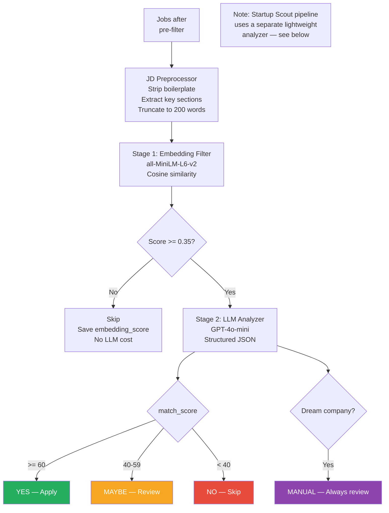
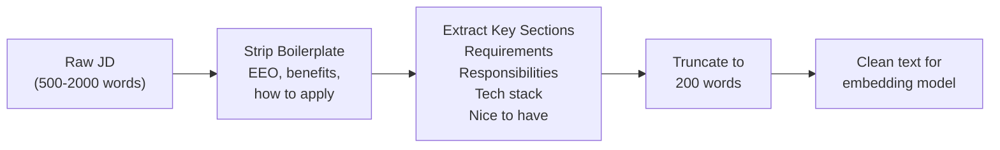
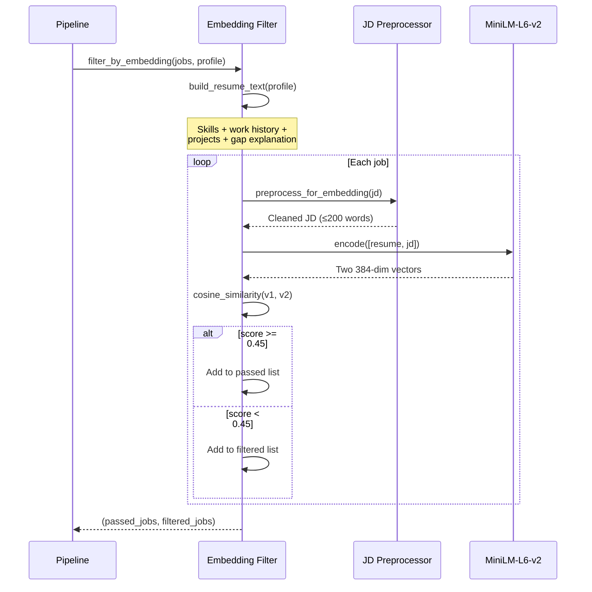
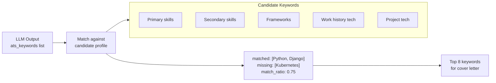

# Analysis Pipeline

Two-stage filter: **embedding** (free, local, fast) then **LLM** (GPT-4o-mini, $0.001/job). Only jobs that pass Stage 1 are sent to Stage 2.

---

## Analysis Flow



---

## Pre-filter (Stage 0)

**File:** `analyzer/freshness_filter.py`

Cheap checks run before any ML or LLM processing.

| Filter | Logic | Config Field |
|--------|-------|-------------|
| Freshness | Skip if `date_posted` > N days ago | `matching.max_job_age_days` (default: 7) |
| Title skip | Title contains banned term | `filters.skip_titles` |
| Company skip | Company in exclusion list | `filters.skip_companies` |
| Keyword require | JD must contain >= 1 keyword | `filters.must_have_any` |

### Title Skip List (default)

```
senior, lead, principal, staff, director, manager, head of,
architect (solo), QA, SDET, test engineer, devops, SRE,
5+ years, 7+ years, 10+ years
```

### Must-Have Keywords (default)

```
python, django, fastapi, react, javascript, node.js, nodejs,
next.js, langchain, RAG, AI, software developer, full stack,
backend, frontend, machine learning, NLP, generative AI
```

---

## JD Preprocessor

**File:** `analyzer/jd_preprocessor.py`

Prepares job descriptions for the embedding model which truncates at 256 tokens (~200 words).



### Boilerplate Patterns Removed

| Pattern | Example |
|---------|---------|
| EEO statements | "We are an equal opportunity employer..." |
| Benefits sections | "What we offer: health insurance, PTO..." |
| Apply instructions | "How to apply: send resume to..." |
| Company about | "About the company: Founded in 2010..." |
| Disclaimers | "Disclaimer: This posting..." |

### Key Sections Extracted

| Section Header | Priority |
|---------------|----------|
| Requirements / Qualifications | High |
| Responsibilities / What you'll do | High |
| Nice to have / Preferred | Medium |
| Tech stack / Technologies | High |
| Experience / Eligibility | Medium |

---

## Stage 1: Embedding Filter

**File:** `analyzer/embedding_filter.py`

| Parameter | Value |
|-----------|-------|
| Model | `all-MiniLM-L6-v2` (sentence-transformers) |
| Size | 80MB download (first run only) |
| Speed | ~50ms per job |
| Cost | Free (runs locally) |
| Threshold | 0.35 (configurable via `matching.fast_filter_threshold`) |
| Max input | 256 tokens (~200 words) |

### How It Works



### Resume Text Construction

The resume embedding is built from the YAML profile (not the PDF):

| Component | Content |
|-----------|---------|
| Identity | Name, degree, location |
| Primary skills | Python, Django, FastAPI, React, LangChain, etc. |
| Secondary skills | PostgreSQL, Docker, Redis, TypeScript, etc. |
| Frameworks | RAG, AI Agents, REST APIs, HuggingFace, etc. |
| Work history | Role, company, duration, tech stack, description |
| Internship projects | Nested project names + descriptions |
| Gap projects | Project name, tech stack, description |
| Gap context | Career gap explanation |

---

## Stage 2: LLM Analyzer

**File:** `analyzer/llm_analyzer.py`

| Parameter | Value |
|-----------|-------|
| Model | GPT-4o-mini |
| Output format | Structured JSON (14 fields) |
| Cost | ~$0.001 per job |
| Temperature | 0.2 (deterministic) |
| Max tokens | 1500 |
| JD truncation | First 3000 chars sent to LLM |

### Scoring Rules

| Signal | Points | Direction |
|--------|--------|-----------|
| Primary skill match | +15 | Per skill |
| Secondary skill match | +8 | Per skill |
| Framework/concept match | +5 | Per skill |
| Location compatible | +10 | Binary |
| Remote option available | +5 | Binary |
| Fresher-friendly (0-2 years) | +10 | Binary |
| Gap-tolerant signals | +5 | Binary |
| Senior role (5+ years) | -30 | Penalty |
| Missing critical skill | -15 | Per skill |

### Decision Thresholds

| Score Range | Decision | Action |
|-------------|----------|--------|
| >= 60 | YES | Apply + generate content |
| 40-59 | MAYBE | Telegram review |
| < 40 | NO | Skip |
| Dream company | MANUAL | Always human review |

### LLM Output Schema

```json
{
    "match_score": 72,
    "required_skills": ["Python", "Django", "React"],
    "matching_skills": ["Python", "Django"],
    "missing_skills": ["React Native"],
    "ats_keywords": ["REST API", "microservices", "CI/CD"],
    "experience_required": "0-3 years",
    "location_compatible": true,
    "remote_compatible": true,
    "company_type": "startup",
    "gap_tolerant": true,
    "red_flags": [],
    "apply_decision": "YES",
    "cold_email_angle": "Your ReAct AI Agent project demonstrates...",
    "gap_framing_for_this_role": "Career gap spent building production-grade...",
    "reasoning": "Strong Python/Django match, startup culture..."
}
```

### Anti-Hallucination Rules in Prompt

The system prompt enforces:
1. Only reference companies the candidate actually worked at
2. Only mention skills the candidate actually has
3. Don't fabricate experience or credentials
4. Be honest about missing skills
5. Score fairly — don't inflate or deflate

---

## ATS Keywords

**File:** `analyzer/ats_keywords.py`

Matches JD-extracted keywords against the candidate's skill set for cover letter optimization.



| Function | Purpose |
|----------|---------|
| `get_candidate_keywords()` | Build full keyword set from profile |
| `match_ats_keywords()` | Compare LLM keywords vs candidate skills |
| `suggest_keywords_for_cover_letter()` | Prioritize keywords for content generation |
