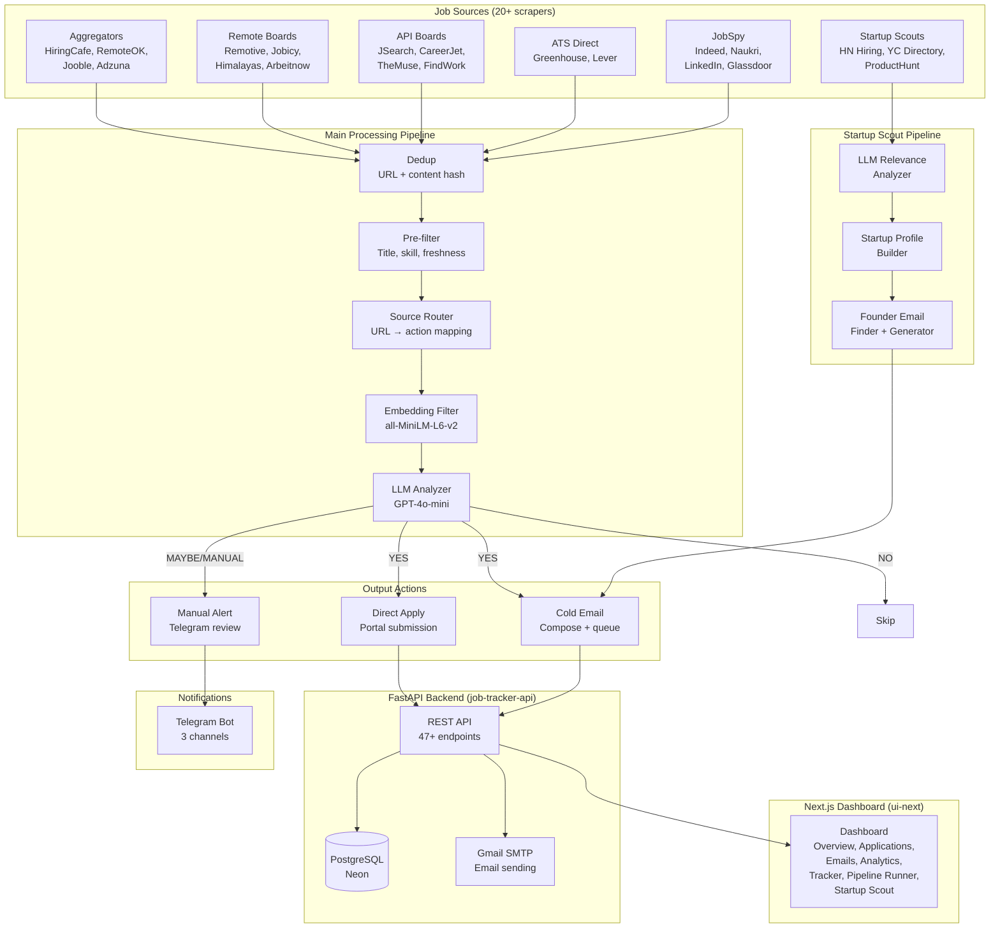
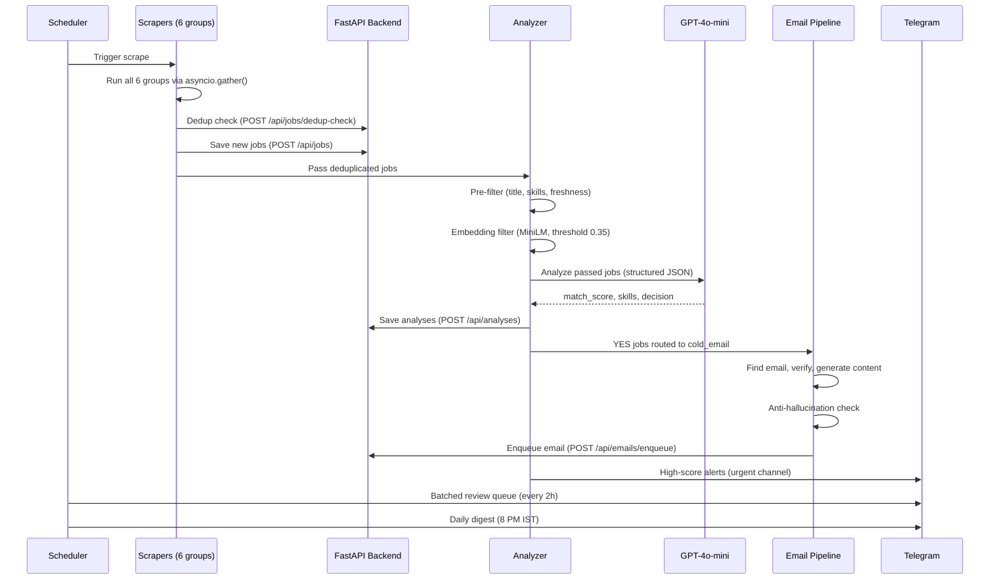
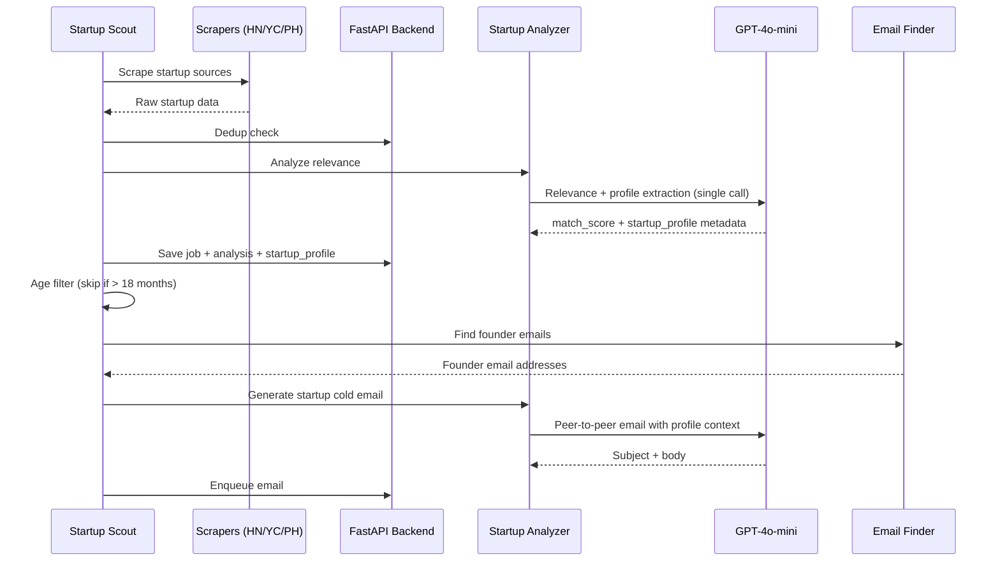
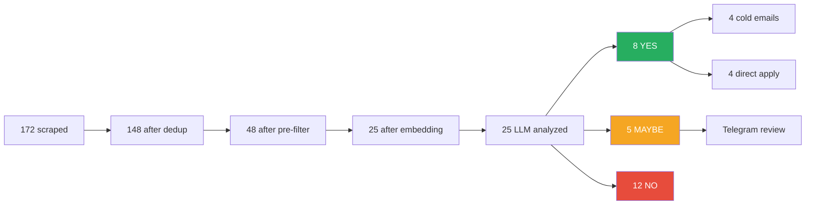
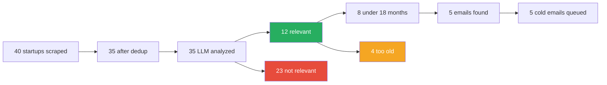

# Architecture

High-level system design of the Job Tracker system — a three-project, four-service architecture with API-first communication.

---

## System Overview



---

## Three-Project Architecture

The system is split into three independent projects:

| Project | Port | Purpose | Deployed On |
|---------|------|---------|-------------|
| **pipeline/** | `8002` | Pipeline microservice + standalone scripts | Local / GitHub Actions (scripts only) |
| **api/** | `8000` | FastAPI backend, database, email sending | Render (free tier) |
| **ui-next/** | `3000` | Next.js dashboard | Vercel / local |

### Communication Pattern

```mermaid
flowchart LR
    UI["ui-next<br/>(Next.js)"] -->|REST API| API["api<br/>(FastAPI + asyncpg)"]
    API -->|HTTP POST /run| PIPE["pipeline server<br/>(FastAPI, port 8002)"]
    PIPE -->|PATCH callback| API
    PIPE -->|REST API<br/>(save data)| API
    API -->|asyncpg| DB[(Neon PostgreSQL)]
    API -->|aiosmtplib| GMAIL["Gmail SMTP"]

    style API fill:#2563eb,color:#fff
    style PIPE fill:#059669,color:#fff
```

**Key design decisions:**
- Neither the pipeline nor the dashboard connect to the database directly. All data flows through the FastAPI backend via HTTP.
- The API dispatches pipeline runs to the pipeline microservice via HTTP, not subprocess. The pipeline reports status back via a callback endpoint.
- Pipeline scripts still work standalone (for GitHub Actions cron jobs) — no pipeline server needed.
- Dashboard deploys without DB access

---

## Component Interaction



---

## Startup Scout Pipeline

A separate pipeline for early-stage startups, running independently from the main flow.



---

## Technology Stack

| Layer | Technology | Purpose |
|-------|-----------|---------|
| **Runtime** | Python 3.12, asyncio | Async pipeline execution |
| **Package Manager** | pip | Dependency management |
| **API Backend** | FastAPI + asyncpg | REST API + PostgreSQL |
| **Pipeline Server** | FastAPI + uvicorn | Pipeline microservice (port 8002) |
| **Database** | Neon PostgreSQL | Job storage, analysis results |
| **LLM** | OpenAI GPT-4o-mini | Job analysis, content generation |
| **Embedding** | all-MiniLM-L6-v2 | Local similarity scoring |
| **HTTP** | httpx (async) | API communication, scraping |
| **Scraping** | python-jobspy | Indeed, Naukri, LinkedIn, Glassdoor |
| **Bot** | python-telegram-bot | Command handling, alerts |
| **Dashboard** | Next.js + shadcn/ui + Recharts | Web UI for monitoring |
| **Email** | aiosmtplib (Gmail SMTP) | Cold email delivery |
| **Config** | YAML + Pydantic | Validated profile config |
| **Prompt Management** | Langfuse | Versioned prompts + LLM tracing |
| **Linting** | Ruff | Import sorting, unused imports, code style |
| **Testing** | pytest (348 tests, 16 files) | Unit tests — no API calls, no network |

---

## Data Flow Summary

### Main Pipeline



### Startup Scout Pipeline


