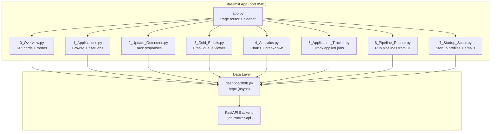
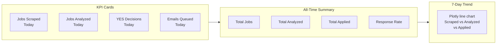
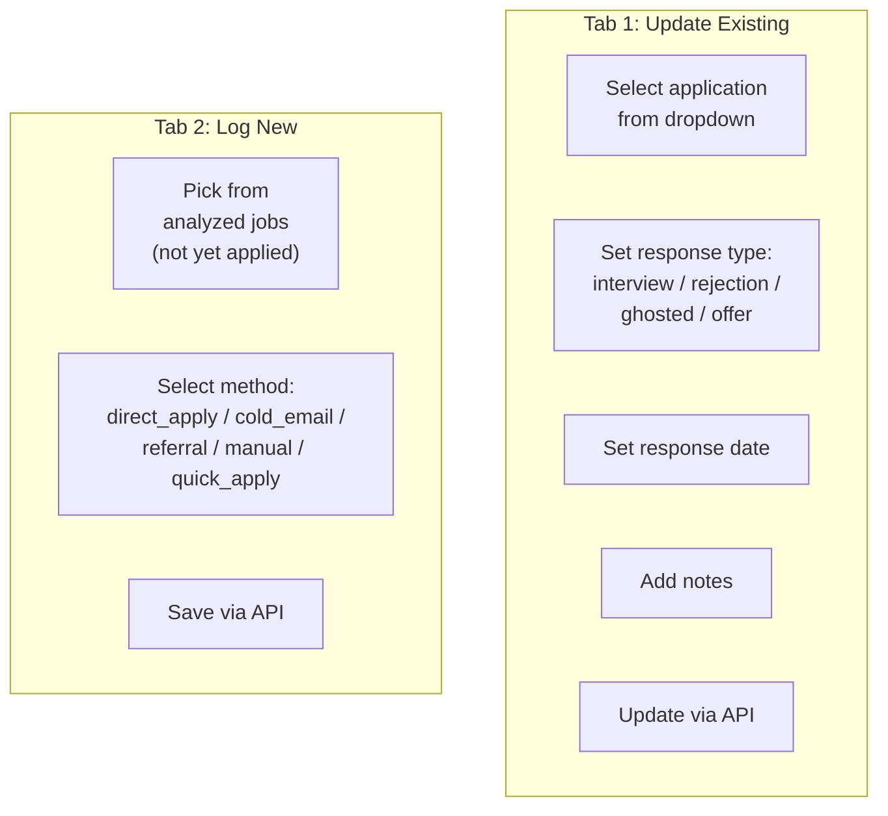

# Dashboard

A web dashboard for monitoring the pipeline, reviewing applications, managing emails, running pipelines, and tracking startup outreach.

**Project:** `ui-next/` (sibling directory) — built with Next.js + shadcn/ui

---

## Dashboard Architecture

### Technical Notes

| Aspect | Detail |
|--------|--------|
| Framework | Streamlit |
| Data layer | httpx → FastAPI REST API (no direct DB) |
| Charts | Plotly |
| Port | 8501 (default) |
| Auth | API key via `X-API-Key` header |
| Deployment | Streamlit Cloud |
| Launch | `streamlit run dashboard/app.py` |

---

## Pages

### Page 0: Overview

Live dashboard showing today's activity and all-time metrics.

| Metric | API Endpoint |
|--------|-------------|
| Stats + KPIs | `GET /api/overview/stats?profile_id=N` |
| Daily trends | `GET /api/analytics/daily-trends?profile_id=N` |

### Page 1: Applications

Filterable table of all analyzed jobs with card/table view toggle.

| Filter | Type | Options |
|--------|------|---------|
| Score range | Slider | 0-100 |
| Decision | Multi-select | YES, MAYBE, NO, MANUAL |
| Source | Multi-select | indeed, naukri, linkedin, etc. |
| Search | Text input | Company or title keyword |
| Date range | Date picker | Start and end date |

**Card view** shows expandable details:
- Match score with color coding (green/yellow/red)
- Matching skills (checkmarks) and missing skills
- Red flags
- Cover letter preview
- Cold email angle
- Link to job URL

### Page 2: Update Outcomes

Two-tab interface for tracking application responses.

| Response Type | Meaning |
|--------------|---------|
| `interview` | Got interview invite |
| `rejection` | Formal rejection received |
| `ghosted` | No response after 14+ days |
| `offer` | Received job offer |

### Page 3: Cold Emails

Email queue viewer with full lifecycle tracking.

| Column | Content |
|--------|---------|
| Status | Color-coded badge (draft/verified/ready/sent/delivered/bounced) |
| Recipient | Email + name + role |
| Verification | Provider + result |
| Subject | Full subject line |
| Preview | First 200 chars of body |
| Dates | Created, verified, sent timestamps |

### Page 4: Analytics

Comprehensive analytics with Plotly charts.

| Chart | Type | Data |
|-------|------|------|
| Daily activity trends | Line (Plotly) | Scraped vs analyzed vs applied by date |
| Score distribution | Pie (Plotly) | YES / MAYBE / NO / MANUAL counts |
| Source platform | Bar (Plotly) | Jobs per source platform |
| Company type | Bar (Plotly) | Startup / MNC / service breakdown |
| Response by method | Bar (Plotly) | Response rates per application method |

### Page 5: Application Tracker

Spreadsheet-style view of all applications with sortable columns and export.

| Feature | Detail |
|---------|--------|
| Data | All applications with job + analysis details |
| View | Sortable dataframe |
| Export | Download as Excel (.xlsx) |
| API | `GET /api/tracker?profile_id=N` |

### Page 6: Pipeline Runner

Run scraping and analysis pipelines directly from the dashboard.

| Feature | Detail |
|---------|--------|
| Source selection | All sources or specific scraper group |
| Job limit | Configurable per run |
| Main pipeline | `POST /api/pipeline/main/run` → dispatched to pipeline microservice (port 8002) |
| Startup scout | `POST /api/pipeline/startup-scout/run` → dispatched to pipeline microservice |
| Status polling | `GET /api/pipeline/runs/{run_id}` (every 3 seconds) |
| Output | Live log display (pipeline service streams stdout via callbacks) |

### Page 7: Startup Scout

Dedicated page for startup scout pipeline results with two-tab layout.

**Sidebar filters:**
- Profile ID
- Source: All / hn_hiring / yc_directory / producthunt
- Funding round: All / pre_seed / seed / series_a / bootstrapped / unknown
- Age range: 0-24 months slider
- Has customers: All / Yes / No
- Search (company name)
- Sort by: Match Score / Founding Date / Data Completeness

**Top metrics row:**

| Metric | Source |
|--------|--------|
| Total Startups | `GET /api/startup-profiles/stats` |
| Avg Match Score | Same endpoint |
| Emails Queued | Same endpoint |
| Avg Completeness | Same endpoint |

**Tab 1: Profile & Analysis** — startup card with founding date, funding, tech stack, founders, product description, match score, skills, cold email angle.

**Tab 2: Cold Email** — email management with editable subject/body, Save/Send/Delete buttons, email status badges, recipient info.

---

## Theme

The dashboard uses a dark theme with custom CSS injected via `st.markdown()`:

| Element | Style |
|---------|-------|
| Background | Dark (#0e1117) |
| Cards | Slightly lighter with border |
| Score badges | Green (>=60), Yellow (40-59), Red (<40), Purple (MANUAL) |
| Tables | Striped rows |
| Sidebar | Branded with project name |
