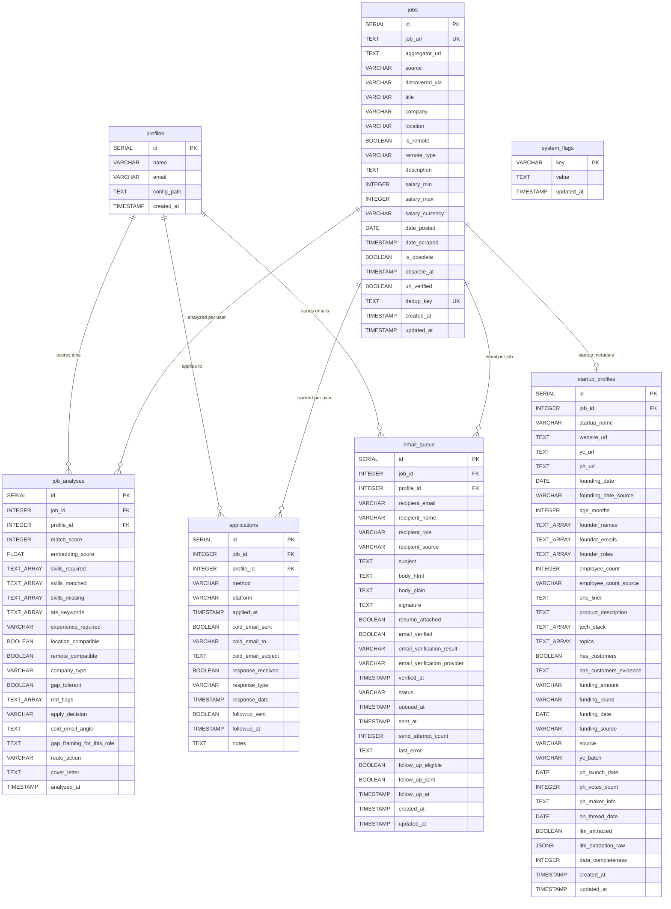
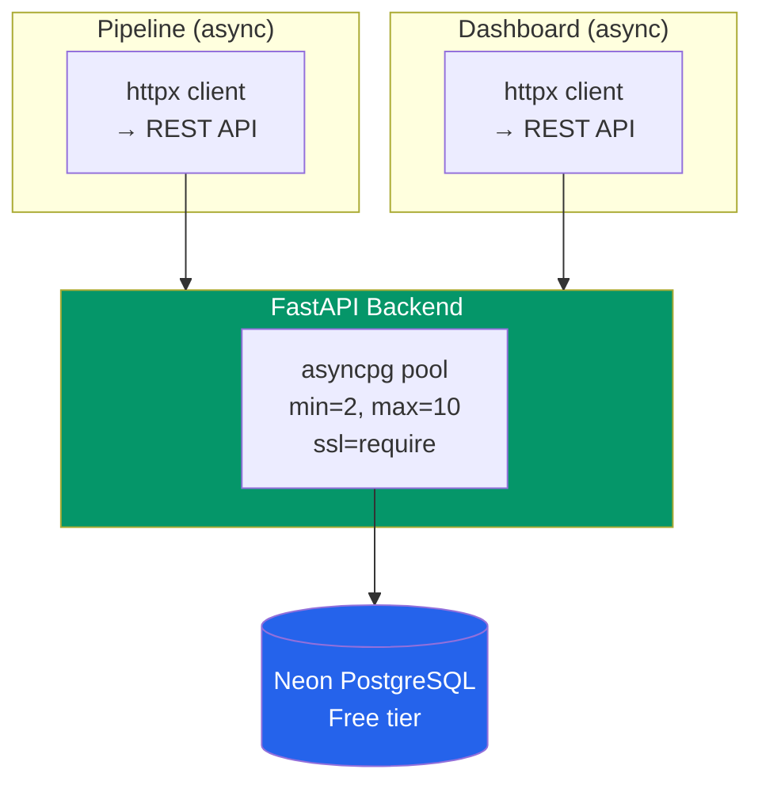

# Database

PostgreSQL on Neon (free tier). The database is managed by the FastAPI backend (`api/`). Both the pipeline and dashboard communicate via REST API — no direct database connections.

---

## ER Diagram

---

## Tables

### `profiles`

One row per user. Links to a YAML config file.

| Column | Type | Description |
|--------|------|-------------|
| `id` | SERIAL PK | Auto-increment |
| `name` | VARCHAR(255) | User's display name |
| `email` | VARCHAR(255) | User's email |
| `config_path` | TEXT | Path to YAML profile |
| `created_at` | TIMESTAMP | Registration time |

### `jobs`

Shared job listings across all users. Populated by scrapers.

| Column | Type | Description |
|--------|------|-------------|
| `id` | SERIAL PK | Auto-increment |
| `job_url` | TEXT UNIQUE | Canonical job URL |
| `aggregator_url` | TEXT | Original aggregator link |
| `source` | VARCHAR(50) | Platform hosting the job (naukri, indeed, linkedin, etc.) |
| `discovered_via` | VARCHAR(50) | How we found it (jobspy, jooble, adzuna, remoteok, hiringcafe, remotive, etc.) |
| `title` | VARCHAR(255) | Job title |
| `company` | VARCHAR(255) | Company name |
| `location` | VARCHAR(255) | Job location |
| `is_remote` | BOOLEAN | Remote availability |
| `remote_type` | VARCHAR(30) | full_remote, hybrid, onsite, remote_country, remote_global |
| `description` | TEXT | Full job description |
| `salary_min` / `salary_max` | INTEGER | Salary range |
| `salary_currency` | VARCHAR(10) | INR, USD, etc. |
| `date_posted` | DATE | When job was originally posted |
| `date_scraped` | TIMESTAMP | When we discovered it |
| `is_obsolete` | BOOLEAN | Whether the job link is dead |
| `obsolete_at` | TIMESTAMP | When the link was found dead |
| `url_verified` | BOOLEAN | Whether HEAD check passed |
| `dedup_key` | TEXT UNIQUE | Hash for deduplication |

### `job_analyses`

Per-user per-job analysis results. Same job can be scored differently for different profiles.

| Column | Type | Description |
|--------|------|-------------|
| `id` | SERIAL PK | Auto-increment |
| `job_id` | FK -> jobs | Reference to job |
| `profile_id` | FK -> profiles | Reference to user |
| `match_score` | INTEGER | 0-100 composite score |
| `embedding_score` | FLOAT | Stage 1 cosine similarity |
| `skills_required` | TEXT[] | Skills the JD requires |
| `skills_matched` | TEXT[] | Candidate skills that match |
| `skills_missing` | TEXT[] | Required but candidate lacks |
| `ats_keywords` | TEXT[] | Keywords for ATS optimization |
| `experience_required` | VARCHAR(50) | "0-2 years", "5+ years", etc. |
| `location_compatible` | BOOLEAN | Location match |
| `remote_compatible` | BOOLEAN | Remote match |
| `company_type` | VARCHAR(30) | startup, mnc, service |
| `gap_tolerant` | BOOLEAN | Company shows gap-tolerance signals |
| `red_flags` | TEXT[] | Concerns about the match |
| `apply_decision` | VARCHAR(20) | YES, NO, MAYBE, MANUAL |
| `cold_email_angle` | TEXT | Personalized outreach hook |
| `gap_framing_for_this_role` | TEXT | How to frame career gap |
| `route_action` | VARCHAR(40) | auto_apply_and_cold_email, cold_email_only, manual_alert |
| `cover_letter` | TEXT | Generated cover letter |
| `analyzed_at` | TIMESTAMP | Analysis time |

**Unique constraint:** `(job_id, profile_id)` — one analysis per user per job.

### `applications`

Tracks every action taken per user per job.

| Column | Type | Description |
|--------|------|-------------|
| `id` | SERIAL PK | Auto-increment |
| `job_id` | FK -> jobs | Reference to job |
| `profile_id` | FK -> profiles | Reference to user |
| `method` | VARCHAR(30) | auto_apply, cold_email, manual_apply, telegram_alert |
| `platform` | VARCHAR(50) | Where applied |
| `applied_at` | TIMESTAMP | Application time |
| `cold_email_sent` | BOOLEAN | Whether cold email was sent |
| `cold_email_to` | VARCHAR(255) | Recipient email |
| `cold_email_subject` | TEXT | Email subject |
| `response_received` | BOOLEAN | Got any response |
| `response_type` | VARCHAR(30) | interview, rejection, ghosted, offer |
| `response_date` | TIMESTAMP | When response came |
| `followup_sent` | BOOLEAN | Follow-up sent |
| `notes` | TEXT | Free-form notes |

**Unique constraint:** `(job_id, profile_id, method)` — one record per method per user per job.

### `email_queue`

Full email lifecycle from composition to delivery.

| Column | Type | Description |
|--------|------|-------------|
| `id` | SERIAL PK | Auto-increment |
| `job_id` | FK -> jobs | Associated job |
| `profile_id` | FK -> profiles | Sender profile |
| `recipient_email` | VARCHAR(255) | Target email |
| `recipient_name` | VARCHAR(255) | Contact name |
| `recipient_role` | VARCHAR(255) | Contact title (HR Manager, CTO, etc.) |
| `recipient_source` | VARCHAR(50) | apollo, snov, hunter, pattern_guess |
| `subject` | TEXT | Email subject |
| `body_html` | TEXT | HTML email body |
| `body_plain` | TEXT | Plain text body |
| `signature` | TEXT | Sender signature |
| `resume_attached` | BOOLEAN | Whether to attach PDF |
| `email_verified` | BOOLEAN | Verification complete |
| `email_verification_result` | VARCHAR(30) | valid, invalid, risky, catch_all, unknown |
| `email_verification_provider` | VARCHAR(30) | hunter, apollo, smtp_check, regex_only |
| `status` | VARCHAR(30) | draft -> verified -> ready -> queued -> sent -> delivered/bounced |
| `send_attempt_count` | INTEGER | Retry counter |
| `last_error` | TEXT | Last failure message |
| `follow_up_eligible` | BOOLEAN | Can send follow-up |
| `follow_up_sent` | BOOLEAN | Follow-up already sent |

### `startup_profiles`

Enriched metadata for startups discovered by the startup scout pipeline. One row per job (1:1 with `jobs` table).

| Column | Type | Description |
|--------|------|-------------|
| `id` | SERIAL PK | Auto-increment |
| `job_id` | FK -> jobs (UNIQUE) | Reference to startup job |
| `startup_name` | VARCHAR(255) | Company/startup name |
| `website_url` | TEXT | Company website |
| `yc_url` | TEXT | Y Combinator directory URL |
| `ph_url` | TEXT | ProductHunt page URL |
| `founding_date` | DATE | When founded (exact or inferred) |
| `founding_date_source` | VARCHAR(30) | yc_batch, ph_launch, llm_inferred |
| `age_months` | INTEGER | Computed age from founding_date |
| `founder_names` | TEXT[] | Founder name list |
| `founder_emails` | TEXT[] | Founder email list |
| `founder_roles` | TEXT[] | Parallel array: CEO, CTO, etc. |
| `employee_count` | INTEGER | Team size |
| `employee_count_source` | VARCHAR(30) | yc_directory, llm_inferred |
| `one_liner` | TEXT | One-line product description |
| `product_description` | TEXT | Longer product description |
| `tech_stack` | TEXT[] | Technologies used |
| `topics` | TEXT[] | Product categories/topics |
| `has_customers` | BOOLEAN | Whether evidence of customers exists |
| `has_customers_evidence` | TEXT | What evidence was found |
| `funding_amount` | VARCHAR(100) | "$2M", "undisclosed", etc. |
| `funding_round` | VARCHAR(30) | pre_seed, seed, series_a, bootstrapped, unknown |
| `funding_date` | DATE | When funded |
| `funding_source` | VARCHAR(30) | yc, crunchbase, llm_inferred |
| `source` | VARCHAR(30) | hn_hiring, yc_directory, producthunt |
| `yc_batch` | VARCHAR(10) | YC batch (W25, S24, etc.) |
| `ph_launch_date` | DATE | ProductHunt launch date |
| `ph_votes_count` | INTEGER | ProductHunt upvotes |
| `ph_maker_info` | TEXT | Maker names and info |
| `hn_thread_date` | DATE | HN Who's Hiring thread date |
| `llm_extracted` | BOOLEAN | Whether LLM extracted metadata |
| `llm_extraction_raw` | JSONB | Raw LLM extraction output |
| `data_completeness` | INTEGER | 0-100 based on populated fields |

### `system_flags`

Runtime state for pipeline control via Telegram commands.

| Key | Default | Description |
|-----|---------|-------------|
| `active` | `true` | Master kill switch |
| `naukri` | `true` | Naukri scraping enabled |
| `indeed` | `true` | Indeed scraping enabled |
| `foundit` | `true` | Foundit scraping enabled |
| `cold_email` | `true` | Cold email sending enabled |
| `scraping` | `true` | All scraping enabled |

---

## Indexes

| Index | Table | Columns | Purpose |
|-------|-------|---------|---------|
| `idx_jobs_company_title` | jobs | company, title | Company search |
| `idx_jobs_source` | jobs | source | Filter by platform |
| `idx_jobs_discovered_via` | jobs | discovered_via | Filter by aggregator |
| `idx_jobs_dedup_key` | jobs | dedup_key | Fast dedup lookup |
| `idx_jobs_date_scraped` | jobs | date_scraped | Freshness queries |
| `idx_analyses_profile` | job_analyses | profile_id | Per-user queries |
| `idx_analyses_score` | job_analyses | match_score | Score range filters |
| `idx_analyses_job_profile` | job_analyses | job_id, profile_id | Unique lookup |
| `idx_applications_profile` | applications | profile_id | Per-user history |
| `idx_applications_method` | applications | method | Method breakdown |
| `idx_applications_applied_at` | applications | applied_at | Date range queries |
| `idx_email_queue_status` | email_queue | status | Queue processing |
| `idx_email_queue_profile` | email_queue | profile_id | Per-user emails |
| `idx_email_queue_job` | email_queue | job_id | Per-job lookup |
| `idx_startup_profiles_job_id` | startup_profiles | job_id | Job lookup (unique) |

---

## Connection Strategy

| Client | Library | Communication |
|--------|---------|---------------|
| Pipeline | httpx (async) | REST API calls to FastAPI backend |
| Dashboard | httpx (async) | REST API calls to FastAPI backend |
| API Backend | asyncpg | Direct PostgreSQL connection |

### Neon Free Tier Gotchas

| Issue | Fix |
|-------|-----|
| Drops idle SSL connections | Connection health check at startup |
| Cold starts (~2s) | Pool warmup on server start |
| Requires SSL | `ssl="require"` on asyncpg pool |
| Auto-suspend after 5 min | First query wakes compute (~2s delay) |
