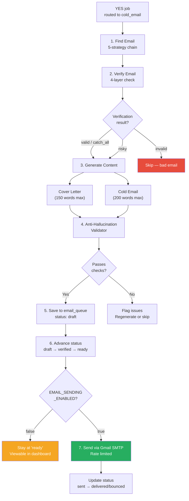
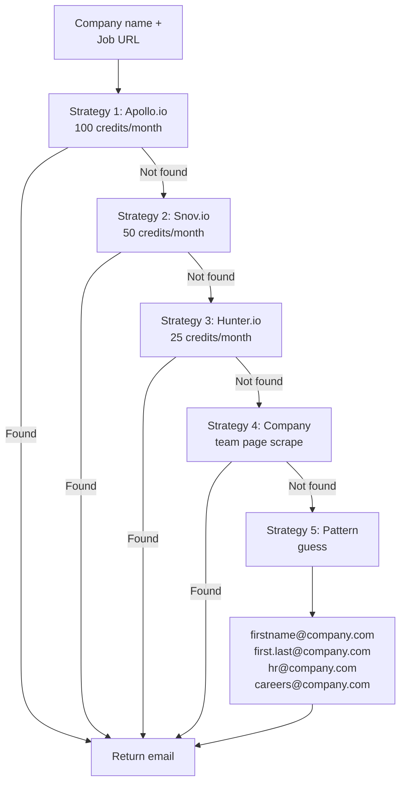
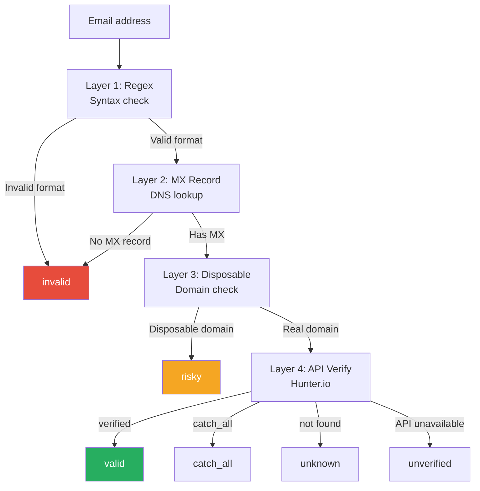
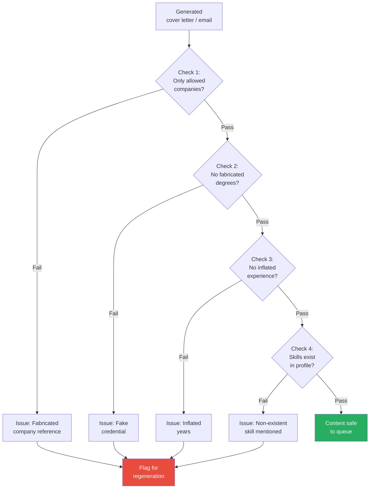
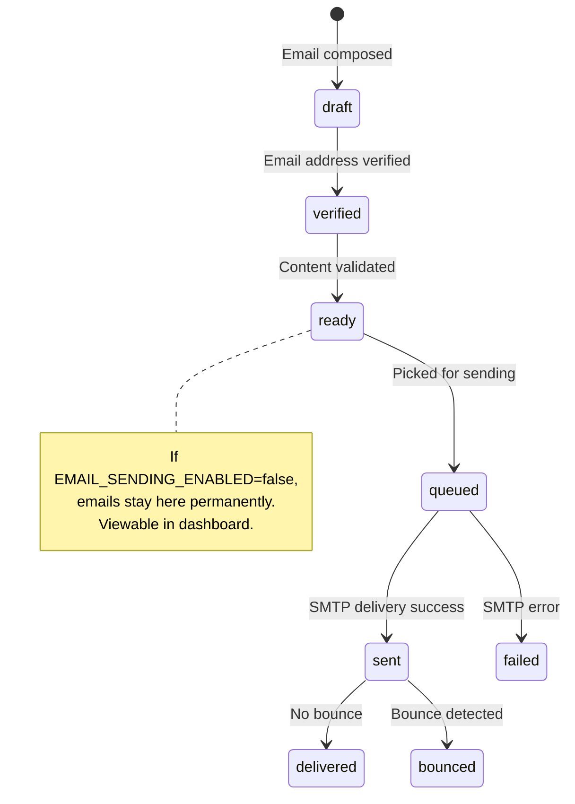
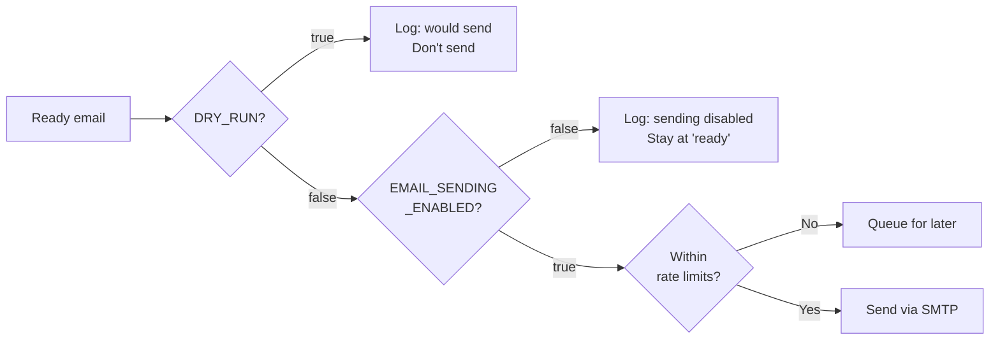

# Email Pipeline

Handles email discovery, verification, content generation, anti-hallucination validation, and queuing. Emails are composed and saved via the API — never sent automatically unless `EMAIL_SENDING_ENABLED=true`.

There are two email flows:
1. **Main pipeline** — formal cold emails for job applications (HR/recruiter tone)
2. **Startup scout** — peer-to-peer cold emails to founders (developer-to-founder tone)

---

## Email Lifecycle



---

## 1. Email Finder

**File:** `emailer/email_finder.py`

5-strategy priority chain — stops at first successful find.



### Strategy Details

| # | Strategy | Source | Free Tier | Speed |
|---|----------|--------|-----------|-------|
| 1 | Apollo.io | API | 100 credits/mo | Fast |
| 2 | Snov.io | API | 50 credits/mo | Fast |
| 3 | Hunter.io | API | 25 credits/mo | Fast |
| 4 | Team page | Web scrape | Unlimited | Medium |
| 5 | Pattern guess | Algorithm | Unlimited | Instant |

### Removed Strategies

| Strategy | Reason |
|----------|--------|
| GitHub commit emails | Violates GitHub Acceptable Use Policies |
| Google dorking | Scraping Google HTML violates ToS |

### Email Patterns Generated

| Pattern | Example |
|---------|---------|
| `firstname@domain` | john@acme.com |
| `first.last@domain` | john.doe@acme.com |
| `firstlast@domain` | johndoe@acme.com |
| `f.last@domain` | j.doe@acme.com |
| `hr@domain` | hr@acme.com |
| `careers@domain` | careers@acme.com |

---

## 2. Email Verifier

**File:** `emailer/verifier.py`

4-layer verification pipeline, each layer progressively more expensive.



### Verification Result

```python
{
    "status": "valid",       # valid, invalid, risky, catch_all, unknown, unverified
    "provider": "hunter",    # Which API verified
    "confidence": 0.92,      # 0.0-1.0
    "mx_valid": True,
    "is_disposable": False,
}
```

---

## 3. Cover Letter Generator

**File:** `emailer/cover_letter.py`

| Parameter | Value |
|-----------|-------|
| Model | GPT-4o-mini |
| Max length | 150 words |
| Inputs | Job analysis + profile + ATS keywords |
| Style | Gap-aware, ATS-optimized |
| Prompts | Langfuse template support |

### Prompt Constraints

- Maximum 150 words
- Mention specific skills matching the JD
- Frame the career gap positively (using `gap_framing_for_this_role` from analysis)
- Include relevant ATS keywords naturally
- No fabricated experience, companies, or certifications
- Professional tone, personalized per company

---

## 4. Cold Email Generator (Main Pipeline)

**File:** `emailer/cold_email.py`

Used for standard job applications — targets HR, recruiters, or hiring managers.

| Parameter | Value |
|-----------|-------|
| Model | GPT-4o-mini |
| Max length | 200 words |
| Output | Subject + plain body + HTML body |
| Features | Unsubscribe line, signature from config |
| Prompts | Langfuse template support |

### Cold Email Structure

```
Subject: [Personalized subject line]

Body:
- Hook: Why this company/role caught your attention
- Value prop: Specific skills matching the JD
- Proof: Relevant project or experience
- CTA: Conversation request

Signature:
  Name
  Phone | Email | GitHub

Unsubscribe line: "Reply STOP to opt out"
```

---

## 4b. Startup Cold Email Generator

**File:** `scripts/_startup_analyzer.py` → `generate_startup_cold_email()`

A separate generator for the startup scout pipeline — targets founders and CTOs with peer-to-peer tone.

| Parameter | Value |
|-----------|-------|
| Model | GPT-4o-mini |
| Max length | 150 words |
| Tone | Developer-to-founder (peer, not applicant) |
| Inputs | Startup profile + analysis + source context |

### Key Differences from Main Cold Email

| Aspect | Main Pipeline | Startup Scout |
|--------|--------------|---------------|
| Target | HR / recruiter | Founder / CTO |
| Tone | Professional applicant | Peer developer |
| Reference | Formal JD | Startup description |
| Source mention | Job board | "Saw on HN / YC / ProductHunt" |
| Max words | 200 | 150 |
| Profile data | Job analysis only | Startup profile (funding, tech stack, team size) |

### Startup-Specific Prompt Injections

When a `startup_profile` is available, the prompt includes:
- **Funding stage + amount** — "just raised your seed round"
- **Tech stack overlap** — "your Python/React stack is exactly what I work with"
- **Team size** — "small team of 5 — I can wear multiple hats"
- **Customer status** — "you already have customers — I can help scale"
- **Source context** — "saw your launch on ProductHunt"

---

## 5. Anti-Hallucination Validator

**File:** `emailer/validator.py`

Checks all LLM-generated content before saving to queue.



### Validation Checks

| Check | What It Catches | Source of Truth |
|-------|----------------|-----------------|
| Company references | "During my time at Google..." (never worked there) | `anti_hallucination.allowed_companies` |
| Degree claims | "My Master's in CS..." (only has B.Tech) | `experience.degree` |
| Experience inflation | "With 5 years of experience..." (has <1 year) | `experience.years` |
| Skill fabrication | "Expert in Kubernetes..." (not in profile) | `skills.primary` + `secondary` + `frameworks` |

---

## 6. Email Queue

All composed emails are saved via `core/api_client.py` → `POST /api/emails/enqueue` to the `email_queue` table in the API backend.

### Status Lifecycle



### Queue API Functions (in `core/api_client.py`)

| Function | API Call | Purpose |
|----------|---------|---------|
| `enqueue_email()` | `POST /api/emails/enqueue` | Save composed email (status: draft) |
| `mark_verified()` | `PUT /api/emails/{id}/verify` | Update verification result |
| `advance_to_ready()` | `PUT /api/emails/{id}/advance` | Move verified emails to ready |

---

## 7. Email Sender

**File:** `emailer/sender.py`

Gmail SMTP via `aiosmtplib` (async). Protected by double safety gates.

### Safety Gates



### Rate Limits & Warmup

| Week | Max per Day | Max per Hour | Delay Between |
|------|------------|-------------|---------------|
| 1 | 5 | 3 | 5-10 min |
| 2 | 8 | 5 | 3-7 min |
| 3 | 12 | 6 | 2-5 min |
| 4+ | 15 | 8 | 1-3 min |

### Email Features

| Feature | Detail |
|---------|--------|
| Format | Plain text + HTML |
| Attachment | Static resume PDF |
| Sender | Gmail with app password |
| Tracking | Status updated via API |
| Error handling | Retry count, last error stored |
