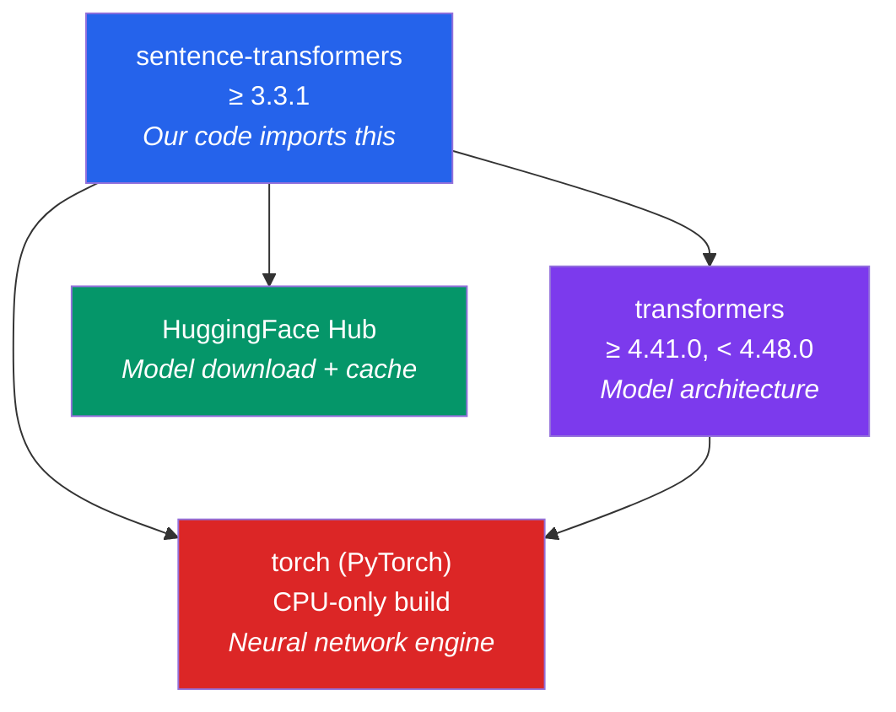
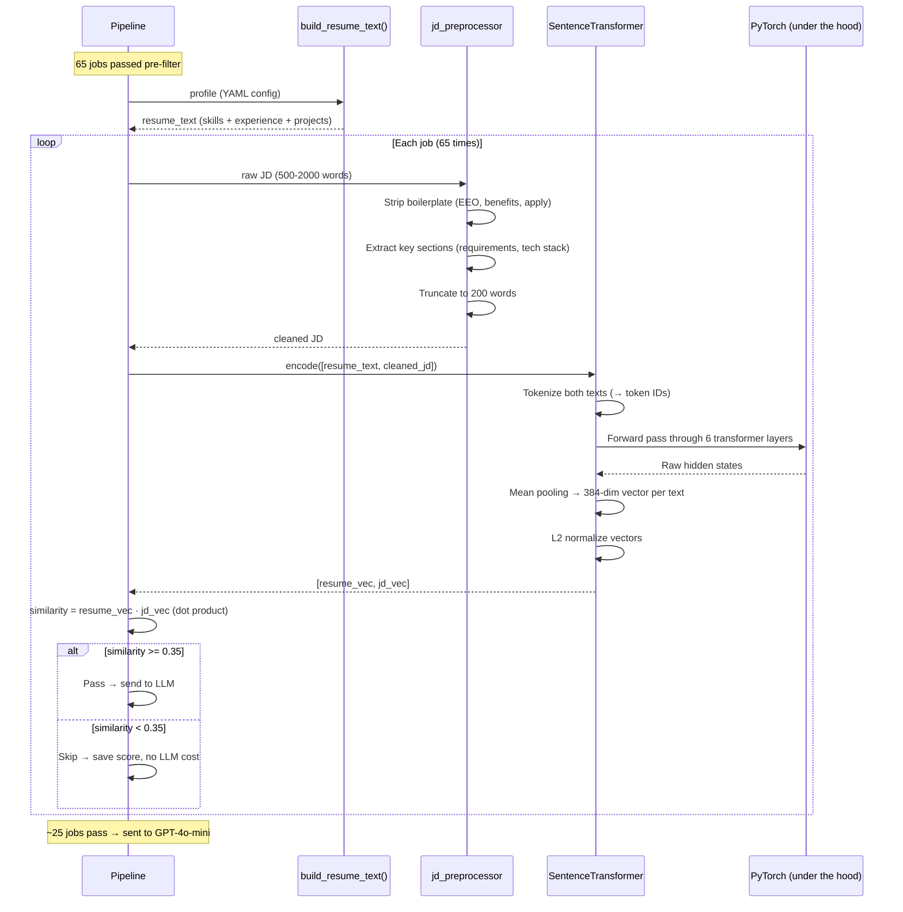

# ML Stack — Embeddings, Models & Libraries

How the pipeline uses machine learning for job-resume similarity scoring, which libraries power it, and how they all fit together.

---

## Why ML in This Pipeline?

The pipeline scrapes 200+ jobs per run. Sending all of them to GPT-4o-mini for analysis would cost ~$0.20 per run and take 10+ minutes. Instead, we use a **free, local ML model** as a first filter:

```
200 jobs scraped
    │
    ▼
┌─────────────────────────────────┐
│  Stage 1: Embedding Filter      │  FREE, local, ~50ms/job
│  all-MiniLM-L6-v2               │  Filters out ~60% of jobs
│  (sentence-transformers + torch) │
└─────────────────────────────────┘
    │
    ▼  (~80 jobs pass)
┌─────────────────────────────────┐
│  Stage 2: LLM Analysis          │  $0.001/job, ~2s/job
│  GPT-4o-mini                     │  Deep analysis of remaining jobs
│  (OpenAI API — no ML libraries)  │
└─────────────────────────────────┘
```

**Result:** Instead of 200 LLM calls ($0.20), we make ~80 LLM calls ($0.08) — saving 60% cost and 60% time. The embedding filter costs $0.

---

## What Are Embeddings?

An embedding converts text into a list of numbers (a "vector") that captures its meaning. Similar texts produce similar numbers; different texts produce different numbers.

```
Text                              → Embedding (384 numbers)
─────────────────────────────────────────────────────────
"Python Django REST API developer" → [0.12, -0.34, 0.56, 0.01, ..., -0.22]
"Python Flask web backend"        → [0.14, -0.30, 0.52, 0.03, ..., -0.19]  ← SIMILAR
"Wind turbine maintenance"        → [0.89,  0.12, -0.45, 0.67, ..., 0.41]  ← DIFFERENT
```

The model learns these number patterns from billions of text examples during training. You don't choose what each number means — the model figures it out.

### Why 384 Numbers?

The model we use (`all-MiniLM-L6-v2`) produces 384-dimensional vectors. More dimensions = more nuance in distinguishing text, but also more memory and computation. 384 is a sweet spot for speed vs accuracy.

### Cosine Similarity

Once you have two vectors, **cosine similarity** measures how "similar" they are:

```
cosine_similarity(resume_vector, jd_vector) → 0.0 to 1.0

1.0 = identical meaning
0.0 = completely unrelated
0.35 = our threshold (configurable)
```

Mathematically, it measures the angle between two vectors. But you don't need to understand the math — just know it's a similarity score from 0 to 1.

```
"Python Django REST API"  vs  "Python Flask backend"    → 0.82 (very similar)
"Python Django REST API"  vs  "React frontend developer" → 0.45 (some overlap)
"Python Django REST API"  vs  "Wind turbine maintenance"  → 0.08 (unrelated)
```

---

## The Library Stack

Four libraries work together. Here's the dependency chain:



Only `sentence-transformers` is imported directly in our code. The rest are dependencies that it uses under the hood.

---

### 1. PyTorch (`torch`)

**What it is:** An open-source machine learning framework created by Meta (Facebook). It's the engine that runs neural networks — the equivalent of what a game engine is to a video game.

**What it does in our project:**
- Provides the tensor operations (matrix math) that power the embedding model
- Handles model loading, forward pass computation, and memory management
- Runs entirely on CPU (we install the CPU-only build — no GPU needed)

**Why CPU-only?**

```bash
# GPU build: ~2GB download, requires NVIDIA GPU + CUDA drivers
pip install torch

# CPU build: ~200MB download, works everywhere
pip install torch --index-url https://download.pytorch.org/whl/cpu
```

Our embedding model processes one job at a time in ~50ms. A GPU would be faster (~5ms), but we don't need that speed for 200 jobs. The CPU build saves 1.8GB of disk space and removes the GPU dependency.

**Where it appears in our setup:**

```
requirements.txt:
  # Embeddings (torch installed separately as CPU-only in CI)

SETUP.md:
  pip install torch --index-url https://download.pytorch.org/whl/cpu

.github/workflows/pipeline.yml:
  pip install torch --index-url https://download.pytorch.org/whl/cpu
```

**Intel Mac compatibility note:** PyTorch dropped x86_64 macOS builds after version 2.2.2. That's why `transformers` is pinned below 4.48 — newer versions require PyTorch >= 2.4 which doesn't exist for Intel Macs.

---

### 2. Transformers (`transformers`)

**What it is:** HuggingFace's library providing 100,000+ pretrained ML models for text, image, and audio tasks. It defines the **architecture** (structure) of models like BERT, GPT, MiniLM, etc.

**What it does in our project:**
- Provides the `MiniLM` model architecture that `all-MiniLM-L6-v2` is built on
- Handles tokenization — converting text into numbers the model understands
- Manages model configuration (layer count, hidden size, attention heads)

**Tokenization example:**

```
Input text: "Python Django REST API developer"

Tokenizer splits into tokens:
  ["python", "django", "rest", "api", "developer"]

Converts to token IDs:
  [18750, 42116, 4717, 17928, 9722]

These IDs are fed into the neural network.
```

The model has a **256 token limit** — roughly 200 words. That's why the JD preprocessor truncates job descriptions before embedding.

**Why pinned below 4.48:**

```
transformers>=4.41.0,<4.48.0
```

`transformers >= 4.48` requires `torch >= 2.4`. But PyTorch 2.2.2 is the last version that supports Intel Macs (x86_64). Pinning below 4.48 keeps Intel Mac compatibility.

---

### 3. Sentence-Transformers (`sentence-transformers`)

**What it is:** A library built **on top of** `transformers` and `torch`, specifically designed for generating text embeddings. While `transformers` can do many things (text generation, classification, translation), `sentence-transformers` focuses on one thing: converting text into embedding vectors.

**What it does in our project:**
- Provides the `SentenceTransformer` class — the only ML import in our code
- Downloads and caches the `all-MiniLM-L6-v2` model from HuggingFace Hub
- Handles the full pipeline: tokenize → model forward pass → pool → normalize

**Our actual usage — the entire ML surface area is 3 lines:**

```python
# embedding_filter.py

from sentence_transformers import SentenceTransformer        # 1. Import

_model = SentenceTransformer("all-MiniLM-L6-v2")            # 2. Load model

embeddings = model.encode([text_a, text_b],                  # 3. Generate embeddings
                          normalize_embeddings=True)
similarity = float(embeddings[0] @ embeddings[1])            # Dot product = cosine sim
```

That's it. Three lines of ML code. Everything else is preprocessing and threshold logic.

**Why `sentence-transformers` instead of raw `transformers`?**

With raw `transformers`, the same task would require ~15 lines:

```python
# What you'd have to write WITHOUT sentence-transformers:
from transformers import AutoTokenizer, AutoModel
import torch

tokenizer = AutoTokenizer.from_pretrained("all-MiniLM-L6-v2")
model = AutoModel.from_pretrained("all-MiniLM-L6-v2")

inputs = tokenizer(texts, padding=True, truncation=True, return_tensors="pt")
with torch.no_grad():
    outputs = model(**inputs)
# Then manually do mean pooling across token embeddings...
# Then normalize the vectors...
# Then compute cosine similarity...
```

`sentence-transformers` wraps all of this into `model.encode()`.

---

### 4. Torchvision — NOT Used

`torchvision` is a PyTorch library for computer vision tasks (image classification, object detection, etc.). **We don't use it.** It sometimes gets installed as an optional dependency of `torch`, but our pipeline is text-only — no images.

---

### 5. HuggingFace Hub (implicit dependency)

**What it is:** A model repository — like GitHub but for ML models. When you call `SentenceTransformer("all-MiniLM-L6-v2")`, it downloads the model files from `huggingface.co/sentence-transformers/all-MiniLM-L6-v2`.

**Cache location:** `~/.cache/huggingface/hub/`

**Behavior:**
- First call: downloads ~80MB model files (takes ~30 seconds)
- Subsequent calls: loads from local cache (takes ~2 seconds)
- No internet required after first download

---

## The Model: all-MiniLM-L6-v2

| Property | Value |
|----------|-------|
| Full name | `sentence-transformers/all-MiniLM-L6-v2` |
| Architecture | MiniLM (distilled from BERT) |
| Parameters | 22.7 million |
| Layers | 6 transformer layers |
| Hidden size | 384 |
| Output dimensions | 384-dimensional vector |
| Max input | 256 tokens (~200 words) |
| Download size | ~80MB |
| Training data | 1 billion+ sentence pairs |
| Speed | ~50ms per text on CPU |
| Cost | Free (open-source, MIT license) |

### Why This Model?

| Alternative | Size | Dimensions | Speed | Why Not |
|------------|------|------------|-------|---------|
| **all-MiniLM-L6-v2** (ours) | 80MB | 384 | 50ms | Best balance of speed, size, and accuracy |
| all-MiniLM-L12-v2 | 120MB | 384 | 80ms | Slightly more accurate, but 60% slower |
| all-mpnet-base-v2 | 420MB | 768 | 150ms | Best accuracy, but 3x slower and 5x larger |
| text-embedding-3-small (OpenAI) | API | 1536 | 200ms | $0.00002/call, adds up over 200 jobs |
| BGE-small-en | 130MB | 384 | 60ms | Comparable quality, slightly larger |

MiniLM-L6-v2 is the standard choice for fast, local embeddings. It's what most open-source projects use when they need "good enough" similarity on a CPU.

### What "MiniLM" Means

MiniLM is a **distilled** version of BERT (a large language model by Google). Distillation means: train a large model first, then train a smaller model to mimic the large one. The small model loses some accuracy but gains massive speed.

```
BERT-base (110M params, 12 layers) → distill → MiniLM (22.7M params, 6 layers)
                                                  ↑
                                           5x fewer params
                                           3x faster inference
                                           ~95% of BERT's accuracy
```

---

## How It All Works in Our Pipeline

### Step-by-Step Flow



### What Happens Inside `model.encode()`

When you call `model.encode(["Python Django developer", "React frontend engineer"])`, here's what happens inside — powered by `transformers` and `torch`:

```
Step 1: TOKENIZATION  (transformers library)
─────────────────────────────────────────────
"Python Django developer"
    → ["[CLS]", "python", "django", "developer", "[SEP]"]
    → [101, 18750, 42116, 9722, 102]

Step 2: EMBEDDING LOOKUP  (torch)
─────────────────────────────────────────────
Each token ID → 384-dimensional vector from lookup table
    101   → [0.02, -0.15, 0.33, ...]  (384 numbers)
    18750 → [0.41,  0.08, -0.12, ...]
    42116 → [0.38,  0.11, -0.09, ...]
    9722  → [0.22, -0.05,  0.17, ...]
    102   → [0.01, -0.01,  0.02, ...]

Step 3: TRANSFORMER LAYERS (torch — 6 layers)
─────────────────────────────────────────────
Each layer applies "self-attention" — tokens look at each other
to understand context. "Python" next to "Django" produces a
different vector than "Python" next to "snake."

    Layer 1: Adjust vectors based on neighboring tokens
    Layer 2: Adjust again with broader context
    ...
    Layer 6: Final contextual representations

Step 4: MEAN POOLING (sentence-transformers)
─────────────────────────────────────────────
Average all token vectors into one 384-dim vector
for the entire sentence:

    [0.02, -0.15, 0.33, ...]   ← [CLS]
    [0.41,  0.08, -0.12, ...]   ← python
    [0.38,  0.11, -0.09, ...]   ← django
    [0.22, -0.05,  0.17, ...]   ← developer
    ─────────────────────────
    [0.26, -0.003, 0.07, ...]   ← MEAN → sentence embedding

Step 5: NORMALIZE (sentence-transformers)
─────────────────────────────────────────────
Scale the vector to unit length (L2 norm = 1.0).
This makes dot product = cosine similarity.
```

---

## Code Walkthrough

### The Only File That Uses ML: `analyzer/embedding_filter.py`

**Lazy loading — model loads only when first needed:**

```python
_model = None

def _load_model():
    global _model
    if _model is None:
        from sentence_transformers import SentenceTransformer    # Lazy import
        _model = SentenceTransformer("all-MiniLM-L6-v2")        # Downloads on first call
    return _model
```

Why lazy? If the pipeline is doing a scrape-only run (no analysis), the 80MB model never loads. The import itself takes ~2 seconds even from cache — no point paying that cost if you don't need it.

**Building the resume text from YAML profile:**

```python
def build_resume_text(profile: ProfileConfig) -> str:
    parts = []
    parts.append(f"{profile.candidate.name}, {profile.experience.degree}")
    parts.append(f"Primary skills: {', '.join(profile.skills.primary)}")
    # ... secondary skills, frameworks, work history, projects, gap explanation
    return "\n".join(parts)
```

This produces something like:

```
Ravi Raj, B.Tech ISE
Location: Bengaluru, India
Primary skills: Python, Django, FastAPI, React, LangChain, LangGraph, Node.js, JavaScript
Secondary skills: PostgreSQL, Docker, Redis, TypeScript, MongoDB, MySQL, ...
Frameworks: RAG, AI Agents, REST APIs, HuggingFace, OpenAI, ...
Software Developer Intern at Zelthy (Jun 2024 – Sep 2024) — Django, Python, React, REST APIs
Project: ReAct AI Agent with LangGraph — Python, LangGraph, LangChain, Streamlit
Project: Hybrid Search RAG Engine — Python, LangChain, OpenAI, FAISS, BM25, Streamlit
Background: Self-directed study in AI/LLM engineering, built RAG and agent systems
```

**Computing similarity:**

```python
def compute_similarity(text_a: str, text_b: str) -> float:
    model = _load_model()
    embeddings = model.encode([text_a, text_b], normalize_embeddings=True)
    similarity = float(embeddings[0] @ embeddings[1])  # Dot product of normalized vectors
    return max(0.0, min(1.0, similarity))               # Clamp to [0, 1]
```

`normalize_embeddings=True` makes each vector unit length, so `dot product = cosine similarity`. The `@` operator in Python is matrix/vector multiplication.

**Async wrapper — keeps the event loop free:**

```python
async def filter_by_embedding(jobs, profile, threshold=None):
    resume_text = build_resume_text(profile)
    loop = asyncio.get_event_loop()

    for job in jobs:
        score = await loop.run_in_executor(         # Run in thread pool
            None, fast_similarity_score, resume_text, jd
        )
        job["embedding_score"] = score
```

`run_in_executor` runs the CPU-heavy embedding computation in a separate thread. Without this, the embedding would block the async event loop and prevent other tasks (like saving results to the API) from running.

### JD Preprocessing: `analyzer/jd_preprocessor.py`

The model only reads 256 tokens (~200 words). A typical JD is 500-2000 words. The preprocessor extracts what matters:

```
Raw JD (1200 words)
    │
    ▼
Strip boilerplate                    Remove: EEO, benefits, "how to apply"
    │
    ▼
Extract key sections                 Keep: requirements, responsibilities, tech stack
    │
    ▼
Truncate to 200 words               First 200 words of extracted sections
    │
    ▼
Clean text (200 words)              Ready for model.encode()
```

**Boilerplate patterns removed:**

| Pattern | Example |
|---------|---------|
| EEO statements | "We are an equal opportunity employer..." |
| Benefits | "What we offer: health insurance, PTO..." |
| Apply instructions | "How to apply: send resume to..." |
| About company | "About the company: Founded in 2010..." |
| Disclaimers | "Disclaimer: This posting..." |

**Key sections kept:**

| Section | Regex Pattern |
|---------|--------------|
| Requirements | `requirements?`, `qualifications?`, `must have` |
| Responsibilities | `responsibilities?`, `what you'll do` |
| Nice to have | `nice to have`, `preferred`, `bonus` |
| Tech stack | `tech stack`, `technologies`, `tools we use` |
| Experience | `experience`, `eligibility` |

---

## Example: One Job Through the Embedding Filter

**Input resume text** (from YAML profile):
```
Ravi Raj, B.Tech ISE
Primary skills: Python, Django, FastAPI, React, LangChain, Node.js
Frameworks: RAG, AI Agents, REST APIs, HuggingFace, OpenAI
Project: Hybrid Search RAG Engine — Python, LangChain, FAISS
```

**Input JD** (after preprocessing):
```
Requirements:
- 0-2 years experience in Python and Django
- Experience with REST APIs and PostgreSQL
- Familiarity with React or similar frontend framework
- Nice to have: Docker, CI/CD, cloud deployment

Responsibilities:
- Build and maintain backend services using Django
- Design RESTful APIs for frontend consumption
- Write unit tests and integration tests
```

**What happens:**

```
model.encode([resume_text, jd_text], normalize_embeddings=True)

resume_vector = [0.12, -0.34, 0.56, ..., -0.22]  (384 numbers)
jd_vector     = [0.14, -0.30, 0.52, ..., -0.19]  (384 numbers)

similarity = resume_vector · jd_vector = 0.71

0.71 >= 0.35 threshold → PASS → sent to GPT-4o-mini for deep analysis
```

**Compare with a bad match:**

```
JD: "Mechanical engineer for wind turbine maintenance, 10+ years experience"

jd_vector = [0.89, 0.12, -0.45, ..., 0.41]

similarity = resume_vector · jd_vector = 0.06

0.06 < 0.35 → SKIP → no LLM cost spent on this irrelevant job
```

---

## Configuration

### Profile Config (`config/profiles/ravi_raj.yaml`)

```yaml
matching:
  embedding_model: "all-MiniLM-L6-v2"
  fast_filter_threshold: 0.35      # Lower = more jobs pass, higher = stricter
  max_job_age_days: 7
```

### Pydantic Model (`core/models.py`)

```python
class MatchingConfig(BaseModel):
    embedding_model: str = "all-MiniLM-L6-v2"
    fast_filter_threshold: float = Field(default=0.45, ge=0.0, le=1.0)
```

### Threshold Tuning

| Threshold | Effect | When to Use |
|-----------|--------|-------------|
| 0.25 | Very loose — most jobs pass | Cast a wide net, rely on LLM to filter |
| 0.35 | Current setting — balanced | Good for generalist profiles |
| 0.45 | Default — moderate | Good for specialized profiles |
| 0.55 | Strict — only strong matches | Reduce LLM costs, risk missing edge cases |

---

## Library Relationship Summary

```
┌────────────────────────────────────────────────────┐
│                 Our Code                            │
│                                                     │
│  embedding_filter.py                                │
│    from sentence_transformers import SentenceTransformer
│    model = SentenceTransformer("all-MiniLM-L6-v2") │
│    embeddings = model.encode([text_a, text_b])      │
│                                                     │
│  That's it. 3 lines of ML code.                     │
└──────────────────────┬─────────────────────────────┘
                       │ uses
                       ▼
┌────────────────────────────────────────────────────┐
│           sentence-transformers >= 3.3.1            │
│                                                     │
│  - SentenceTransformer class                        │
│  - Model download from HuggingFace Hub              │
│  - encode() → tokenize + forward + pool + normalize │
│  - Manages the full embedding pipeline              │
└──────────┬─────────────────────┬───────────────────┘
           │ uses                │ uses
           ▼                    ▼
┌──────────────────┐  ┌─────────────────────────────┐
│  transformers    │  │  torch (PyTorch)             │
│  >= 4.41, < 4.48 │  │  CPU-only build              │
│                  │  │                               │
│  - MiniLM model  │  │  - Tensor operations          │
│    architecture  │  │  - Neural network forward pass│
│  - Tokenizer     │  │  - Matrix multiplication      │
│  - Config files  │  │  - Memory management          │
└──────┬───────────┘  └───────────────────────────────┘
       │ uses
       ▼
┌────────────────────────────────────────────────────┐
│  torch (PyTorch) — same library                     │
│  transformers uses torch for all computation        │
└────────────────────────────────────────────────────┘
```

---

## Files Reference

| File | Role | ML Libraries Used |
|------|------|-------------------|
| `analyzer/embedding_filter.py` | Embedding similarity scoring | `sentence-transformers` |
| `analyzer/jd_preprocessor.py` | Text preprocessing for model input | None (pure regex) |
| `core/models.py` | `MatchingConfig` with model name + threshold | None (config only) |
| `requirements.txt` | Pins `sentence-transformers` + `transformers` | — |
| `.github/workflows/pipeline.yml` | Installs CPU-only `torch` in CI | — |

**No other files in the project import or use ML libraries.** All ML is contained in `embedding_filter.py`.
