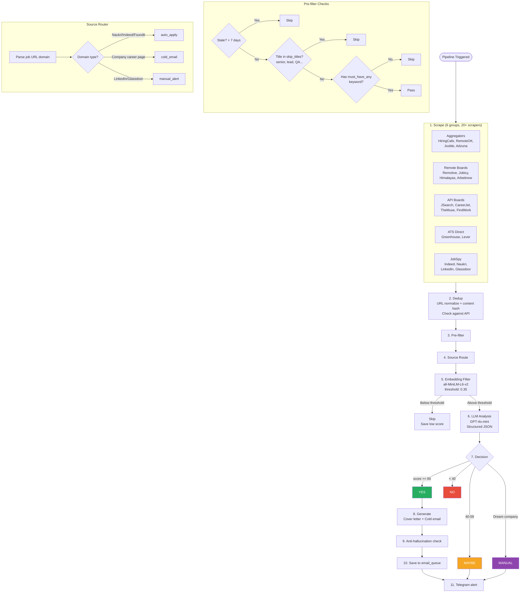
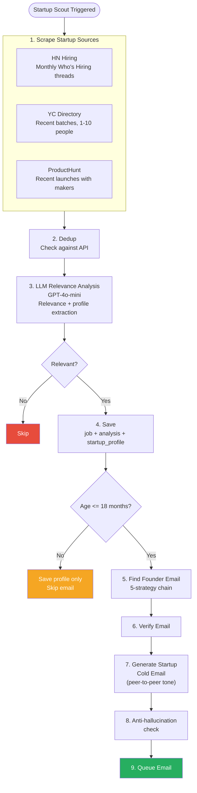
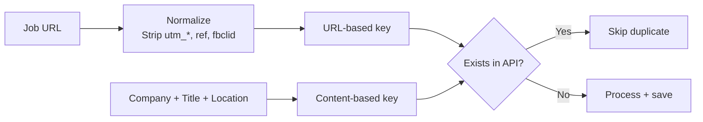

# Pipeline Flow

Two independent pipelines: the **main pipeline** (scrape + analyze formal JDs) and the **startup scout** (find early-stage startups + reach out to founders).

---

## Main Pipeline — End-to-End Flow

**Trigger methods:**
- **From UI:** `POST /api/pipeline/main/run` → API dispatches to pipeline service (port 8002) → service runs stages and reports status via callback
- **From CLI:** `python scripts/dry_run.py --source <source> --limit <N>`
- **From GitHub Actions:** Runs `scripts/dry_run.py` directly (no pipeline server needed)



---

## Startup Scout Pipeline

Targets early-stage startups with no formal JDs.

**Trigger methods:**
- **From UI:** `POST /api/pipeline/startup-scout/run` → API dispatches to pipeline service
- **From CLI:** `python scripts/startup_scout.py --source <source> --limit <N>`



---

## Pipeline Steps Detail

### Step 1: Scrape

All scrapers are auto-discovered via the `@scraper(name, group)` decorator and run concurrently via `asyncio.gather()`.

| Group | Scrapers | Typical Yield |
|-------|----------|--------------|
| Aggregators | HiringCafe, RemoteOK, Jooble, Adzuna | 80-150 jobs |
| Remote Boards | Remotive, Jobicy, Himalayas, Arbeitnow | 20-40 jobs |
| API Boards | JSearch, CareerJet, TheMuse, FindWork | 30-70 jobs |
| ATS Direct | Greenhouse, Lever (per dream company) | 10-30 jobs |
| JobSpy | Indeed, Naukri, LinkedIn, Glassdoor | 100-200 jobs |
| Startup Scouts | HN Hiring, YC Directory, ProductHunt | 30-80 startups |

### Step 2: Dedup



Dedup check runs against the API: `POST /api/jobs/dedup-check` with URLs and dedup keys.

### Step 3: Pre-filter

| Filter | Config Field | Example |
|--------|-------------|---------|
| Freshness | `matching.max_job_age_days` | Skip if > 7 days old |
| Title skip | `filters.skip_titles` | "senior", "lead", "QA", "5+ years" |
| Keyword require | `filters.must_have_any` | "python", "react", "AI", "software developer" |
| Company skip | `filters.skip_companies` | (empty by default) |

### Step 5: Embedding Filter

| Parameter | Value |
|-----------|-------|
| Model | all-MiniLM-L6-v2 |
| Size | 80MB (local) |
| Speed | ~50ms per job |
| Cost | Free |
| Threshold | 0.35 (configurable via `matching.fast_filter_threshold`) |

### Step 6: LLM Analysis

| Parameter | Value |
|-----------|-------|
| Model | GPT-4o-mini |
| Output | Structured JSON (14 fields) |
| Cost | ~$0.001 per job |

### Scoring Rules

| Signal | Points |
|--------|--------|
| Primary skill match | +15 each |
| Secondary skill match | +8 each |
| Framework match | +5 each |
| Location compatible | +10 |
| Remote available | +5 |
| Fresher-friendly | +10 |
| Gap-tolerant signals | +5 |
| Senior role (5+ years) | -30 |
| Missing critical skill | -15 each |

---

## Startup Scout Steps Detail

### Step 3: LLM Relevance + Profile Extraction

A single LLM call performs both relevance scoring and startup metadata extraction:

| Field | Purpose |
|-------|---------|
| `relevant` | Boolean — is this startup relevant? |
| `match_score` | 0-100 composite score |
| `cold_email_angle` | Personalized outreach hook |
| `startup_profile` | Structured metadata (founders, tech stack, funding, etc.) |

### Step 4: Startup Profile Building

Merges LLM-extracted data with structured source data:

| Source | Overrides |
|--------|-----------|
| YC Directory | `yc_batch`, founding date from batch, `team_size`, `one_liner` |
| ProductHunt | `ph_maker_data` -> founder names, `ph_launch_date` -> founding date |
| HN Hiring | `hn_thread_date`, all other fields from LLM only |

### Step 5-9: Email Flow

Same email pipeline as main flow (find -> verify -> generate -> validate -> queue) but with:
- **Startup cold email generator** instead of standard cold email
- **Founder/CTO targeting** instead of HR
- **Peer-to-peer tone** instead of applicant tone
- **Startup profile context** injected into prompt

---

## Example Pipeline Run

### Main Pipeline

```
Scraped:     250 jobs (JobSpy: 150, Aggregators: 60, Remote: 25, API: 15)
Dedup:       210 unique (40 duplicates removed)
Pre-filter:  65 passed (145 filtered: stale, wrong title, missing keywords)
Embedding:   30 passed (35 below 0.35 threshold)
LLM:         30 analyzed
  -> 10 YES, 7 MAYBE, 13 NO
Tailored:    8 resumes (2 fallback to static — service timeout)
Emails:      5 cold emails queued
Alerts:      3 urgent Telegram notifications
```

### Startup Scout

```
Scraped:     45 startups (HN: 25, YC: 12, PH: 8)
Dedup:       38 unique (7 duplicates)
LLM:         38 analyzed
  -> 14 relevant, 24 not relevant
Age filter:  10 under 18 months (4 too old)
Emails:      6 founder emails found
Queued:      6 cold emails queued
```
