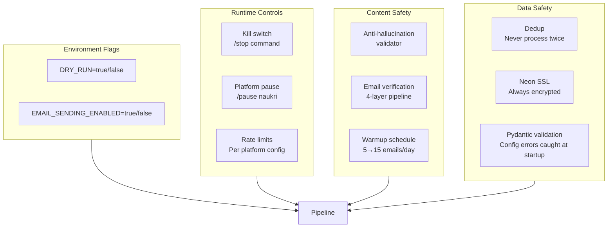
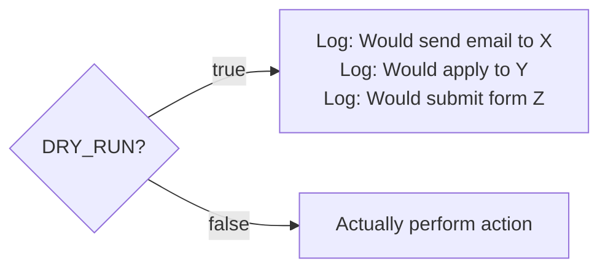
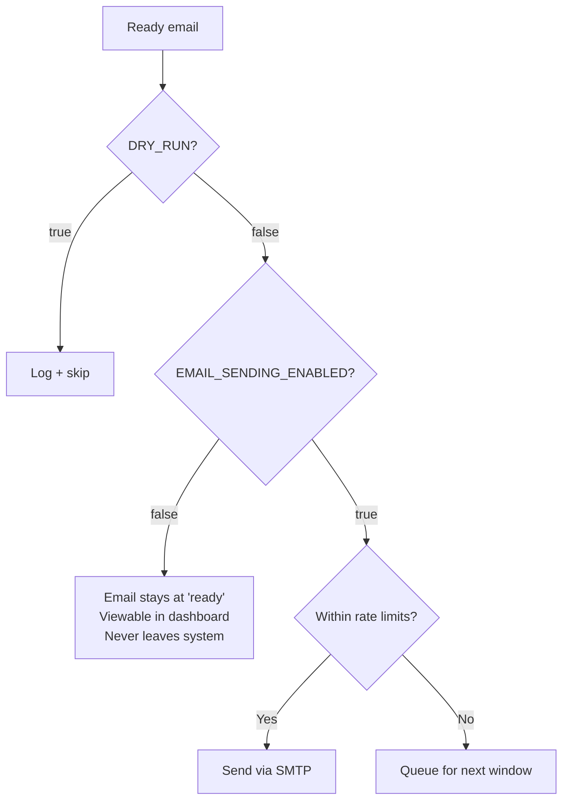
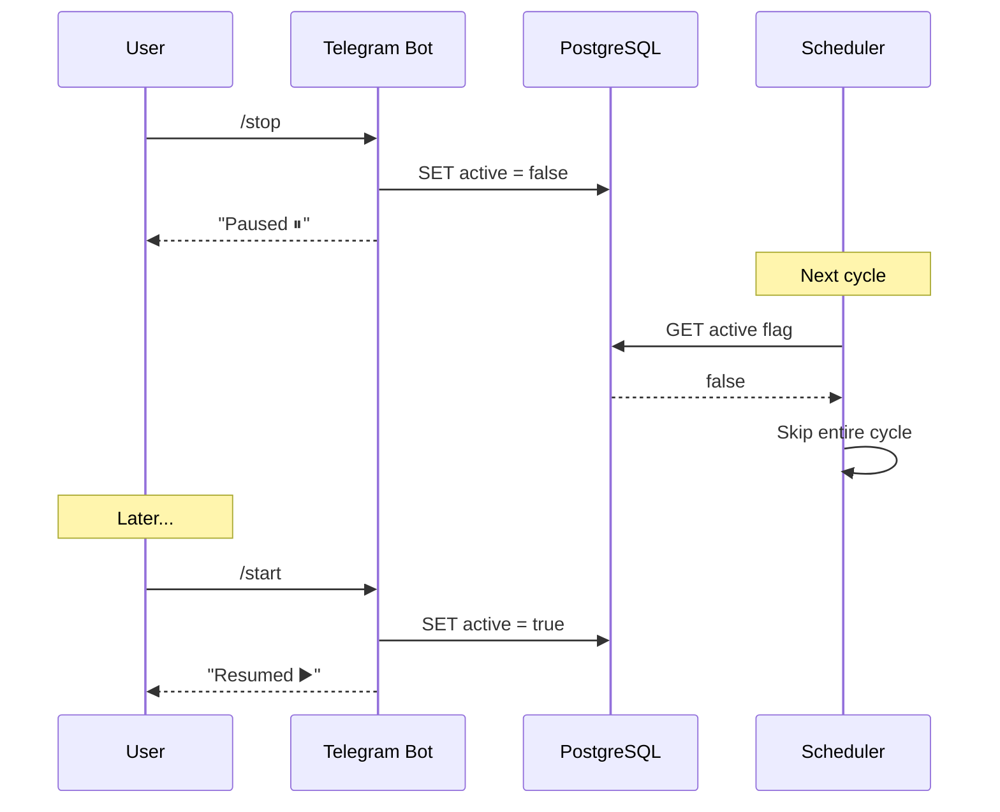
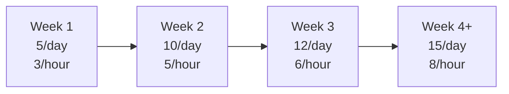
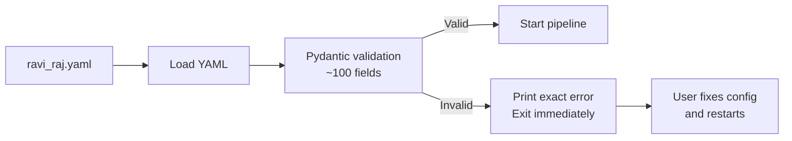

# Safety & Guards

Multiple layers of protection ensure the system never takes unintended actions.

---

## Safety Architecture



---

## DRY_RUN Mode

The primary safety gate. When `DRY_RUN=true`:

| Action | Normal | DRY_RUN |
|--------|--------|---------|
| Scrape jobs | Runs | Runs |
| Dedup check | Runs | Runs |
| Save to DB | Runs | Runs |
| Embedding filter | Runs | Runs |
| LLM analysis | Runs | Runs |
| Generate cover letter | Runs | Runs |
| Generate cold email | Runs | Runs |
| Send email | **Sends** | **Logs only** |
| Auto-apply (future) | **Submits** | **Logs only** |
| Telegram alerts | Sends | Sends |

### Where DRY_RUN is Checked



Every function that performs a destructive or externally-visible action checks this flag:
- `emailer/sender.py` — email delivery
- `applier/` (future) — form submission
- `scheduler/cron.py` — pipeline cycles respect the flag

---

## EMAIL_SENDING_ENABLED

A second gate specifically for email delivery. Independent from DRY_RUN.



**Default state:** `EMAIL_SENDING_ENABLED=false`. Emails are always composed and saved but never sent until explicitly enabled.

---

## Kill Switch

Telegram `/stop` command sets `system_flags.active = false` in the database.



### Platform-Level Pause

Individual platforms can be paused without stopping everything:

| Command | Flag | Effect |
|---------|------|--------|
| `/pause naukri` | `system_flags.naukri = false` | Skip Naukri scraping |
| `/pause indeed` | `system_flags.indeed = false` | Skip Indeed scraping |
| `/pause cold_email` | `system_flags.cold_email = false` | Stop all cold emails |
| `/pause scraping` | `system_flags.scraping = false` | Stop all scrapers |

---

## Rate Limits

### Scraper Rate Limits

| Platform | Limit | Source |
|----------|-------|--------|
| Jooble | 500 req/day | API terms |
| Adzuna | Generous | API terms |
| RemoteOK | No limit | Public API |
| HiringCafe | No limit | Public API |
| JobSpy | Configurable per platform | Profile config |

### Email Rate Limits

| Parameter | Config Field | Default |
|-----------|-------------|---------|
| Max per day | `cold_email.max_per_day` | 5 (week 1) → 15 (week 4+) |
| Max per hour | `cold_email.max_per_hour` | 3-8 |
| Delay between | Randomized | 1-10 min (with jitter) |

### Warmup Schedule



---

## Anti-Hallucination

Validates all LLM-generated content before saving.

| Check | Catches | Source of Truth |
|-------|---------|-----------------|
| Company references | Fabricated work history | `anti_hallucination.allowed_companies` |
| Degree claims | Fake credentials | `experience.degree` |
| Experience years | Inflated tenure | `experience.years` |
| Skill references | Non-existent skills | Full skills list from profile |

### Allowed Companies List

Only these companies can be mentioned in generated content:

```yaml
allowed_companies:
  - "Zelthy"
  - "Jivo"
  - "Upwork"
  - "RNSIT"
```

Any other company reference in a cover letter or cold email is flagged for regeneration.

---

## Config Validation

Pydantic validates the entire YAML config at startup. If any field is invalid, the system prints a clear error and exits — never runs with bad config.



### Example Validation Errors

```
ValidationError: 1 validation error for ProfileConfig
skills -> primary
  field required (type=value_error.missing)

ValidationError: 1 validation error for ProfileConfig
matching -> fast_filter_threshold
  ensure this value is less than or equal to 1.0 (type=value_error.number.not_le)
```

---

## Data Safety

| Guard | Mechanism |
|-------|-----------|
| Deduplication | URL hash + content hash, checked before processing |
| SSL encryption | `ssl="require"` on all Neon connections |
| Connection recovery | `pool_pre_ping=True` handles Neon idle drops |
| No destructive SQL | App never runs DROP or TRUNCATE |
| Env secrets | `.env` file, never committed (in `.gitignore`) |
| API key isolation | Each key in separate env var, not in config files |
