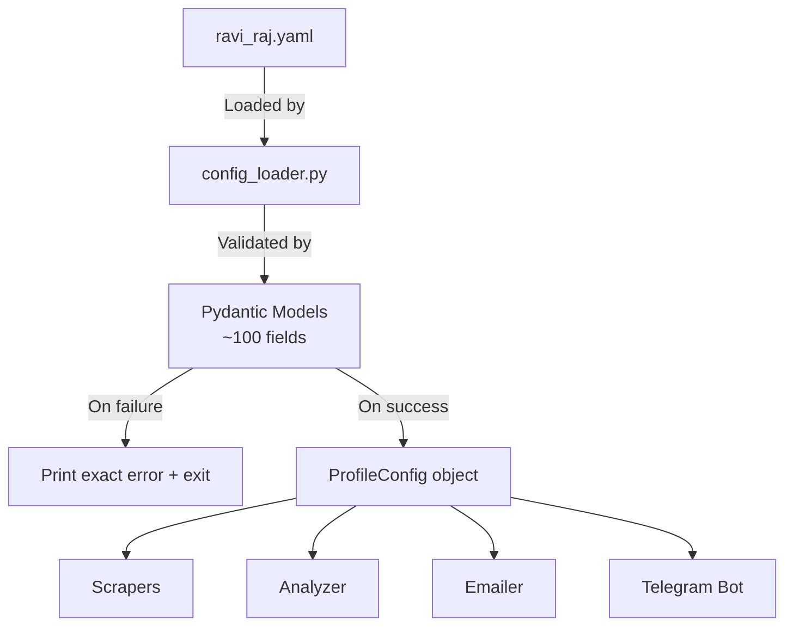

# Setup & Installation

---

## Prerequisites

| Requirement | Version | Notes |
|------------|---------|-------|
| Python | 3.12+ | Required for `X | Y` union types |
| pip | Latest | Package manager |
| OpenAI API | GPT-4o-mini | ~$5 credit needed |

**Note:** The database is managed by `api/` (sibling directory). The pipeline communicates via REST API — no direct database setup needed.

---

## Project Structure

The system is split into three independent projects:

| Project | Purpose | Setup |
|---------|---------|-------|
| **pipeline/** | Scraping, analysis, email generation | This guide |
| **api/** | FastAPI backend + PostgreSQL | See `api/docs/deployment.md` |
| **ui/** | Streamlit dashboard | See `ui/README.md` |

---

## Quick Start

```bash
# 1. Enter project
cd pipeline

# 2. Install dependencies
pip install -r requirements.txt

# 3. Copy env template and fill in your keys
cp .env.example .env

# 4. Validate your profile config
python scripts/test_config.py config/profiles/ravi_raj.yaml

# 5. Test LLM connectivity
python scripts/test_llm.py

# 6. Dry run — main pipeline (scrape + analyze, no side effects)
DRY_RUN=true python scripts/dry_run.py --limit 10

# 7. Dry run — startup scout pipeline
python scripts/startup_scout.py --source hn_hiring --limit 5
```

---

## Environment Variables

### Required

| Variable | Description | Example |
|----------|-------------|---------|
| `API_BASE_URL` | FastAPI backend URL | `https://your-api.onrender.com` or `http://localhost:8000` |
| `API_SECRET_KEY` | API authentication key | Matches `API_SECRET_KEY` on the API server |
| `OPENAI_API_KEY` | GPT-4o-mini for analysis + generation | `sk-...` |

### Optional -- Telegram

| Variable | Description |
|----------|-------------|
| `TELEGRAM_BOT_TOKEN` | Bot token from @BotFather |
| `TELEGRAM_URGENT_CHAT_ID` | Channel for high-score alerts |
| `TELEGRAM_DIGEST_CHAT_ID` | Channel for daily summary |
| `TELEGRAM_REVIEW_CHAT_ID` | Channel for review queue |

### Optional -- Aggregator APIs

| Variable | Description | Signup |
|----------|-------------|--------|
| `JOOBLE_API_KEY` | Jooble job search API | [jooble.org](https://jooble.org/api/about) (1-3 day wait) |
| `ADZUNA_APP_ID` | Adzuna app ID | [developer.adzuna.com](https://developer.adzuna.com/) |
| `ADZUNA_APP_KEY` | Adzuna app key | Same as above |
| `RAPIDAPI_KEY` | RapidAPI key for JSearch API | [rapidapi.com](https://rapidapi.com/) -- subscribe to JSearch |
| `THEMUSE_API_KEY` | TheMuse job board API key | [themuse.com/developers](https://www.themuse.com/developers) |
| `CAREERJET_AFFILIATE_ID` | CareerJet affiliate ID | [careerjet.com](https://www.careerjet.com/partners/) |
| `FINDWORK_API_KEY` | FindWork.dev API token | [findwork.dev](https://findwork.dev/) |

### Optional -- Email Finding

| Variable | Description | Free Tier |
|----------|-------------|-----------|
| `APOLLO_API_KEY` | Apollo.io email finder | 100 credits/month |
| `SNOV_USER_ID` | Snov.io OAuth client ID | 50 credits/month |
| `SNOV_API_SECRET` | Snov.io OAuth client secret | Same as above |
| `HUNTER_API_KEY` | Hunter.io email finder + verifier | 25 credits/month |

### Optional -- Email Sending

| Variable | Description |
|----------|-------------|
| `GMAIL_ADDRESS` | Sender Gmail address for cold email outreach |
| `GMAIL_APP_PASSWORD` | Gmail 2FA app password (16-char, from Google Account -> Security -> App Passwords) |

### Required -- Prompt Management

| Variable | Description |
|----------|-------------|
| `LANGFUSE_SECRET_KEY` | Langfuse secret key |
| `LANGFUSE_PUBLIC_KEY` | Langfuse public key |
| `LANGFUSE_HOST` | Langfuse host URL (defaults to `https://cloud.langfuse.com`) |

> **Note:** Langfuse keys are **required** — all LLM prompts (`job-analysis`, `cold-email`, `cover-letter`) are fetched from Langfuse at runtime. Without valid keys, LLM analysis calls will return `None` and jobs will be skipped. See [Langfuse docs](./langfuse.md) for setup.

### Safety Flags

| Variable | Default | Description |
|----------|---------|-------------|
| `DRY_RUN` | `false` | Disables all destructive actions |
| `EMAIL_SENDING_ENABLED` | `false` | Emails saved but never sent |
| `LOG_LEVEL` | `INFO` | `DEBUG`, `INFO`, `WARNING`, `ERROR` |

---

## Profile Configuration

Each user has a YAML profile at `config/profiles/`. See [the full config reference](./configuration.md) or use `config/profiles/example_profile.yaml` as a template.



### Key Config Sections

| Section | Fields | Purpose |
|---------|--------|---------|
| `candidate` | name, email, phone, github, location | Identity |
| `skills.primary` | List of strings | Core skills (+15 per match) |
| `skills.secondary` | List of strings | Supporting skills (+8 per match) |
| `skills.frameworks` | List of strings | Concepts (+5 per match) |
| `experience` | years, degree, work_history, gap_projects | Background |
| `filters.must_have_any` | List of keywords | Pre-filter inclusion |
| `filters.skip_titles` | List of strings | Pre-filter exclusion |
| `matching` | threshold, max_age, prefer_fresher | Tuning |
| `platforms` | Per-platform enable/disable + rate limits | Platform control |
| `aggregators` | Per-aggregator enable/disable + keys | Aggregator control |
| `dream_companies` | List of companies | Always MANUAL review |

---

## Verifying Setup

```bash
# Check API backend connectivity
python -c "import httpx; r = httpx.get('http://localhost:8000/api/health'); print(r.json())"

# Check LLM works
python scripts/test_llm.py

# Check Telegram channels
python scripts/test_telegram.py

# Check scrapers (quick test)
python scripts/test_scrapers.py --source jobspy --count 3

# Run startup scout (small test)
python scripts/startup_scout.py --source hn_hiring --limit 3
```

---

## Running the Pipeline

### Main Pipeline (Scrape + Analyze)

```bash
# Dry run (no side effects)
DRY_RUN=true python scripts/dry_run.py --limit 10

# Full run
python scripts/dry_run.py --limit 50
```

### Startup Scout Pipeline

```bash
# Single source
python scripts/startup_scout.py --source hn_hiring --limit 10

# All startup sources
python scripts/startup_scout.py --source all --limit 20
```

### Scheduled Execution

The pipeline can be run via:
- **GitHub Actions** — scheduled cron job (daily at 3:00 AM UTC). CI runs `ruff check` (lint) then `pytest` (348 tests) before each pipeline execution.
- **Local cron** — `crontab -e`
- **Dashboard** — Pipeline Runner page (`POST /api/pipeline/run`)
