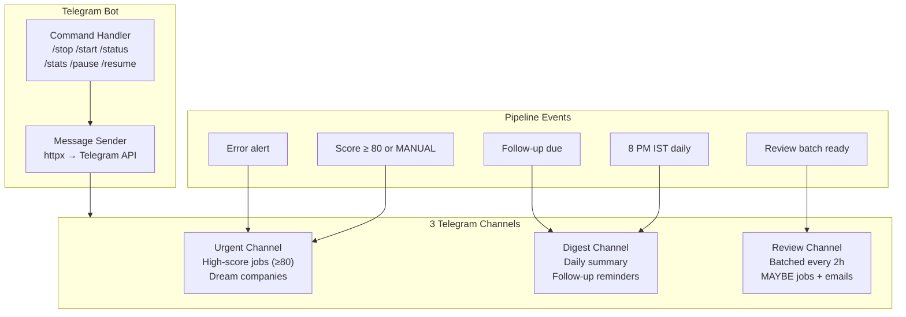
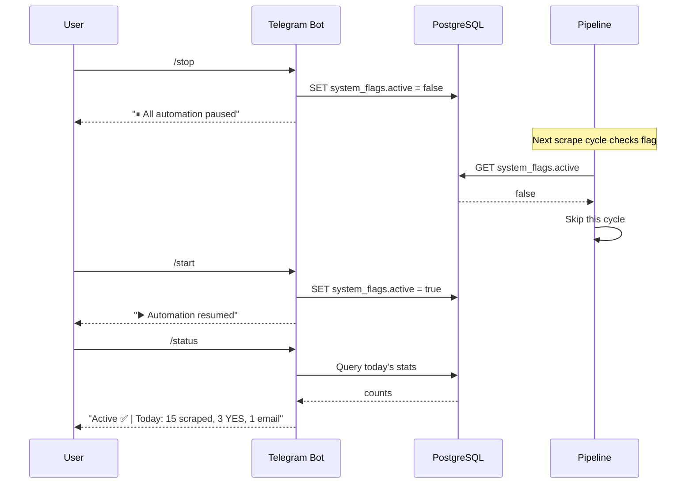
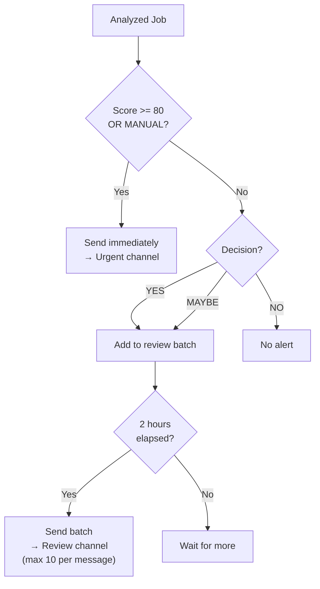
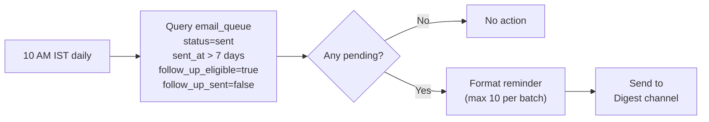
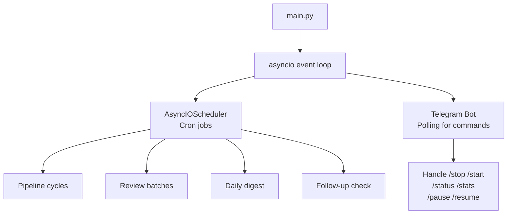

# Telegram Bot & Scheduler

The Telegram bot provides real-time alerts and pipeline control. The scheduler runs the automation on a cron-like schedule with IST timezone.

---

## Telegram Architecture



---

## Channels

| Channel | Chat ID Env Var | Content | Frequency |
|---------|----------------|---------|-----------|
| Urgent | `TELEGRAM_URGENT_CHAT_ID` | High-score matches, dream companies, errors | Real-time |
| Digest | `TELEGRAM_DIGEST_CHAT_ID` | Daily summary, follow-up reminders | Once daily (8 PM IST) |
| Review | `TELEGRAM_REVIEW_CHAT_ID` | MAYBE jobs, email queue preview | Every 2 hours |

---

## Message Formats

### Job Alert (Urgent)

```
🎯 HIGH MATCH: Software Developer at Visa

Score: 85/100
Skills: Python ✅, Django ✅, React ✅, AWS ❌
Decision: YES
Remote: ✅ Hybrid

🔗 Apply: https://careers.visa.com/...
📧 Cold email angle: "Your RAG project aligns with..."
```

### Email Review (Review Channel)

```
📧 COLD EMAIL REVIEW

To: john.doe@visa.com (via Apollo, verified ✅)
Subject: Python Developer — Visa opening
Status: ready

Preview: Hi John, I noticed Visa's software team...

---
2 more emails in queue
```

### Error Alert

```
⚠️ PIPELINE ERROR

Component: JobSpy scraper
Error: Connection timeout after 30s
Time: 2025-01-15 14:30 IST

Pipeline will retry next cycle.
```

---

## Bot Commands

**File:** `bot/commands.py`

| Command | Description | Response |
|---------|-------------|----------|
| `/stop` | Pause all automation | Sets `system_flags.active = false` |
| `/start` | Resume all automation | Sets `system_flags.active = true` |
| `/status` | Current system state | Active/paused + today's stats |
| `/stats` | Weekly analytics | Jobs scraped, analyzed, applied, response rates |
| `/pause <platform>` | Pause one platform | `naukri`, `indeed`, `foundit`, `cold_email`, `scraping` |
| `/resume <platform>` | Resume one platform | Same platforms as above |

### Command Flow



---

## Review Queue

**File:** `bot/review_queue.py`

Prevents notification spam by batching alerts.

### Alert Routing



### Message Splitting

Telegram has a 4096-character limit per message. Batches exceeding this are split into multiple messages.

---

## Scheduler

**File:** `scheduler/cron.py`

Uses APScheduler `AsyncIOScheduler` with explicit IST timezone.

### Cron Schedule

```mermaid
gantt
    title Daily Schedule (IST)
    dateFormat HH:mm
    axisFormat %H:%M

    section Scraping
    Scrape cycle 1    :09:00, 1h
    Scrape cycle 2    :10:00, 1h
    Scrape cycle 3    :11:00, 1h
    Scrape cycle 4    :12:00, 1h
    Scrape cycle 5    :13:00, 1h
    Scrape cycle 6    :14:00, 1h
    Scrape cycle 7    :15:00, 1h
    Scrape cycle 8    :16:00, 1h
    Scrape cycle 9    :17:00, 1h
    Scrape cycle 10   :18:00, 1h
    Scrape cycle 11   :19:00, 1h
    Scrape cycle 12   :20:00, 1h
    Scrape cycle 13   :21:00, 1h
    Scrape cycle 14   :22:00, 1h

    section Reviews
    Review batch 1    :09:00, 30m
    Review batch 2    :11:00, 30m
    Review batch 3    :13:00, 30m
    Review batch 4    :15:00, 30m
    Review batch 5    :17:00, 30m
    Review batch 6    :19:00, 30m
    Review batch 7    :21:00, 30m

    section Digest
    Daily digest      :20:00, 30m

    section Follow-ups
    Follow-up check   :10:00, 30m
```



| Job | Schedule | Timezone | Description |
|-----|----------|----------|-------------|
| Scrape cycle | Every hour, 9 AM - 10 PM | IST | Full pipeline: scrape → analyze → route |
| Review batch | Every 2 hours | IST | Send batched MAYBE/review items to Telegram |
| Daily digest | 8:00 PM | IST | Summary of today's activity |
| Follow-up check | 10:00 AM | IST | Remind about unanswered cold emails (7+ days) |

### Timezone Handling

All scheduled jobs use `ZoneInfo('Asia/Kolkata')` — critical for correct IST timing. Every scheduled function is `async` to work with the `AsyncIOScheduler`.

---

## Follow-up Reminders

**File:** `scheduler/followup.py`

Checks cold emails sent 7+ days ago with no response.



### Follow-up Message

```
📋 FOLLOW-UP REMINDERS (3 pending)

1. john@visa.com — Software Developer (sent Jan 8)
2. hr@boeing.com — Python Engineer (sent Jan 7)
3. careers@stripe.com — Backend Dev (sent Jan 6)

Reply to review or mark as ghosted in dashboard.
```

---

## Bot + Scheduler Integration

The Telegram bot polling and the scheduler run in parallel within the same async event loop.


